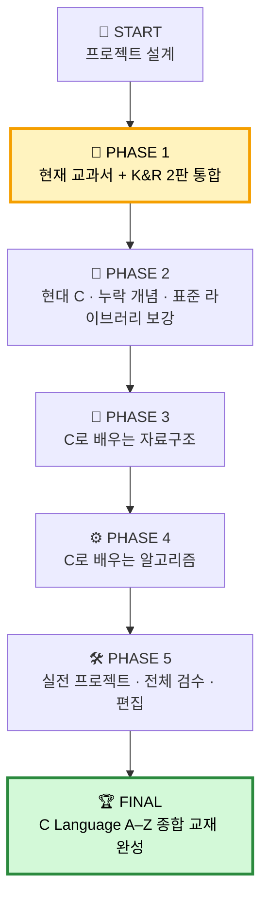
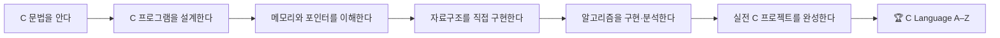

# C Language Book Project

> **C 언어 입문부터 포인터·메모리, 표준 라이브러리, 자료구조, 알고리즘, 실전 프로젝트까지 한 흐름으로 연결하는 개인 종합 교재 제작 프로젝트**


---

## 🎯 최종 목표

이 프로젝트의 목표는 단순한 C 문법 요약집을 만드는 것이 아니다.

최종적으로 한 권의 흐름 안에서 다음 학습 경로를 완성한다.

**C 언어 기초 → 핵심 문법 → 함수와 프로그램 구조 → 배열·포인터 → 문자열·구조체 → 포인터 심화·동적 메모리 → 파일·프로그램 구성 → C 심화 → 자료구조 → 알고리즘 → 실전 프로젝트** (표준 라이브러리는 부록 레퍼런스)

완성된 책은 다음 세 가지 역할을 동시에 수행하는 것을 목표로 한다.

- **교과서** — 처음부터 순서대로 학습할 수 있다.
- **참고서** — 필요한 문법과 개념을 다시 찾아볼 수 있다.
- **실습서** — 직접 코드를 작성하고 실행하며 이해할 수 있다.

---

# 🗺️ 전체 로드맵



### 현재 위치

```text
START
  │
  ▼
🟡 PHASE 1  ← WE ARE HERE
  │
  ▼
⚪ PHASE 2
  │
  ▼
⚪ PHASE 3
  │
  ▼
⚪ PHASE 4
  │
  ▼
⚪ PHASE 5
  │
  ▼
🏆 C LANGUAGE A–Z COMPLETE
```

---

# 📊 진행도

> 진행률은 감으로 정하지 않고 **아래에 정의된 체크포인트 완료 개수**를 기준으로 갱신한다.

## 전체 콘텐츠 진행률

```text
[░░░░░░░░░░░░░░░░░░░░] 0%
```

현재는 **책 본문 집필 전 설계 단계**다. README와 로드맵 구축은 프로젝트 기반 작업으로 별도 관리한다.

| Phase | 내용 | 상태 |
|---|---|---|
| Project Setup | 저장소·로드맵·집필 원칙 확정 | ✅ 완료 |
| PHASE 1 | 현재 교과서 + K&R 2판 통합 | 🟡 현재 단계 |
| PHASE 2 | 현대 C와 누락 영역 보강 | ⚪ 예정 |
| PHASE 3 | 자료구조 | ⚪ 예정 |
| PHASE 4 | 알고리즘 | ⚪ 예정 |
| PHASE 5 | 실전 프로젝트·전체 검수·출판형 편집 | ⚪ 예정 |

---

# 🟡 지금 당장 하는 일 — PHASE 1

## 목표

현재 배우고 있는 C 언어 교과서의 **Chapter 1~17을 기준 골격**으로 사용하고,  
**The C Programming Language, 2nd Edition (K&R)** 의 핵심 개념과 설명 포인트를 대조하여 부족한 부분을 보강한다.

두 책을 단순히 이어 붙이지 않는다.

최종 결과는 다음 구조를 목표로 한다.

> **현재 교과서의 학습 흐름 + K&R의 핵심 통찰 + 새로 작성한 쉬운 설명·예제·그림·연습문제**

---

## PHASE 1 핵심 체크포인트

진행률은 아래 8개 작업을 기준으로 계산한다.

- [x] **1. 프로젝트 전체 로드맵과 집필 원칙 확정**
- [x] **2. 현재 교과서 Chapter 1~17 세부 목차 추출**
- [x] **3. K&R 2판 전체 세부 목차·핵심 주제 추출**
- [x] **4. 교과서 × K&R 세부 대응표 작성**
- [x] **5. 두 책 모두에서 부족한 C 개념 목록 작성**
- [x] **6. 우리 책의 C 본편 최종 아키텍처·목차 확정**
- [x] **7. 각 Chapter별 상세 집필 명세 작성**
- [ ] **8. Chapter 1부터 본문 집필 시작**

### PHASE 1 준비 진행률

```text
[██████████████░░░░░░] 7 / 8
```

> 이 수치는 **PHASE 1을 쓰기 시작하기 위한 준비 체크포인트** 기준이다.  
> 실제 본문 집필이 시작되면 Chapter별 진행률을 별도로 관리한다.

---

# 🔍 PHASE 1에서 만들 핵심 산출물

## 1. 현재 교과서 세부 구조표

현재 기준 교과서의 큰 구조는 다음과 같다.

| Chapter | 주제 |
|---:|---|
| 1 | 프로그래밍의 개념 |
| 2 | 프로그램 작성 과정 |
| 3 | C 프로그램 구성 요소 |
| 4 | 변수와 자료형 |
| 5 | 수식과 연산자 |
| 6 | 조건문 |
| 7 | 반복문 |
| 8 | 함수 |
| 9 | 변수 범위와 순환 호출 |
| 10 | 배열 |
| 11 | 포인터 |
| 12 | 문자와 문자열 |
| 13 | 구조체 |
| 14 | 포인터 활용 |
| 15 | 스트림과 파일 입출력 |
| 16 | 전처리 및 다중 소스 파일 |
| 17 | 동적 메모리 |

단순 Chapter 제목만 대응시키지 않고 각 장을 **세부 개념 단위**로 분해한다.

예를 들어 포인터 단원은 다음처럼 더 작게 나눈다.

- 주소의 개념
- 주소 연산자 `&`
- 역참조 연산자 `*`
- 포인터 변수
- 포인터 초기화
- NULL 포인터
- 포인터와 함수
- 배열과 포인터
- 포인터 연산
- 다중 포인터
- 잘못된 포인터 사용
- 동적 메모리와의 연결

---

## 2. K&R 2판 분석표

K&R은 원문을 복제하는 자료가 아니라 **개념 보강용 기준 자료**로 사용한다.

분석 시 다음을 기록한다.

- 어떤 주제를 다루는가
- 현재 교과서의 어느 Chapter와 연결되는가
- 교과서보다 더 강조하는 개념은 무엇인가
- 현대 C 학습에도 유지할 가치가 있는 설명은 무엇인가
- 오래된 환경에 의존하는 부분은 무엇인가
- 우리 책에 어떤 방식으로 재구성할 것인가

---

## 3. 교과서 × K&R 대응표

최종적으로 다음과 같은 세부 대응표를 만든다.

| 우리 교과서 | K&R 관련 영역 | 처리 방향 |
|---|---|---|
| 변수와 자료형 | Types, Operators and Expressions | 통합·보강 |
| 조건문 | Control Flow | 통합 |
| 반복문 | Control Flow | 통합 |
| 함수 | Functions and Program Structure | 대폭 보강 |
| 배열 | Pointers and Arrays | 포인터와 연결 |
| 포인터 | Pointers and Arrays | 대폭 보강 |
| 문자열 | Pointers and Arrays / Library | 통합 |
| 구조체 | Structures | 보강 |
| 파일 입출력 | Input and Output | 보강 |
| 전처리 | Functions and Program Structure | 보강 |
| 동적 메모리 | 표준 라이브러리 관련 내용 + 추가 자료 | 별도 확장 |

실제 작업에서는 이 표를 **Chapter 수준보다 더 작은 세부 개념 수준**까지 확장한다.

---

# 🧭 내용 분류 기준

각 개념은 다음 네 종류로 관리한다.

| 구분 | 의미 |
|---|---|
| 🟢 **기본** | 현재 교과서 설명을 중심으로 구성 |
| 🟡 **보강** | K&R의 핵심 설명을 참고해 더 깊게 설명 |
| 🔵 **추가** | 두 책만으로 부족하여 새롭게 작성 |
| 🟣 **심화** | 초급 본문 이후 읽을 내용 |

이 분류를 이용해 무엇이 교과서 기반인지, 무엇을 K&R에서 보강했는지, 무엇을 새로 추가했는지 추적한다.

---

# 📚 최종 책의 거시적 구성

> 아래 PART 구성은 프로젝트 진행 중 세부 조정될 수 있다.

## PART 1. C와 프로그래밍의 시작

프로그램, 소스 코드, 컴파일러, 실행 파일, 빌드 과정, C 프로그램의 기본 구조.

## PART 2. C의 기본 문법

변수, 자료형, 연산자, 조건문, 반복문.

## PART 3. 함수와 프로그램 구조

함수 선언·정의, 매개변수, 반환값, 스코프, 저장 기간, 재귀, 프로그램 분할 사고.

## PART 4. 배열과 포인터

배열, 주소, 포인터 기초, 배열과 포인터의 관계.

## PART 5. 문자열과 구조체

문자, 문자열, 구조체, 구조체 배열, 구조체 포인터, `enum`, `typedef`, 공용체 기초 등.

## PART 6. 포인터 심화와 동적 메모리

이중 포인터, 동적 메모리, 소유권 규율, 동적 구조체와 연결 리스트 입문(자료구조 연결 다리).

## PART 7. 파일과 프로그램 구성

스트림, 텍스트·바이너리 파일, 명령행 인수, 전처리기, 헤더 파일, 다중 소스 파일, 컴파일과 링크.

## PART 8. C 심화

함수 포인터와 제네릭 기법, 저수준 C, 정의되지 않은 동작과 이식성. 표준 라이브러리는 별도 티칭 PART가 아니라 부록 B 레퍼런스로 이동.

## PART 9. C로 배우는 자료구조

배열, 연결 리스트, 스택, 큐, 덱, 트리, BST, 힙, 우선순위 큐, 해시 테이블, 그래프.

## PART 10. C로 배우는 알고리즘

복잡도, 검색, 정렬, 재귀, 분할정복, 백트래킹, 그리디, DFS, BFS, 최단경로 등.

## PART 11. 실전 C 프로그래밍

학생 관리, 도서 관리, 주소록, 파일 분석기, 명령행 도구, 자료구조 라이브러리 등 종합 프로젝트.

---

# ✍️ Chapter 집필 표준

모든 Chapter를 기계적으로 같은 틀에 끼워 넣지 않는다. **공통 필수 요소 + 선택 요소 + 주제별 필수 요소**로 나눈다.

**공통 필수:** 학습 목표, 선행 개념 연결, 왜 필요한지, 핵심 개념·문법, 검증 가능한 예제, 자주 하는 실수, 핵심 정리, 연습문제.

**선택 요소:** 실행 흐름 추적, K&R 보강 박스, 현대 C·이식성 박스, 심화 주제, 디버거·도구 박스, 역사적 배경.

**주제별 필수:** 포인터·배열·문자열·구조체·동적 메모리에는 메모리 시각화와 오류 코드 비교를 적극 사용하고, Chapter 18에는 자료구조 진입용 체크리스트를 둔다.

각 내용 블록은 출처 성격 `[T]`(기준 교과서) / `[K]`(K&R) / `[E]`(외부 현대 C 보강)과 내용 역할 🟢 기본 / 🟡 보강 / 🔵 추가 / 🟣 심화를 구분해 추적한다. 세부 규칙은 `docs/phase1/06-chapter-specification.md`를 기준으로 한다.

---

# 🧠 설명 원칙

이 책은 전문용어를 피하는 책이 아니라 **전문용어를 제대로 이해하게 만드는 책**을 목표로 한다.

처음 등장하는 중요한 개념은 가능하면 다음 순서로 설명한다.

1. **읽는 법**
2. **뜻**
3. **왜 필요한가**
4. **어디에 쓰이는가**
5. **가장 작은 예제**
6. **실제 프로그램 예제**

예를 들어 `dereference`를 단순히 “역참조”라고 번역하고 끝내지 않는다.

> 역참조(dereference)는 포인터 안에 저장된 주소를 따라가서 **그 주소에 있는 실제 값에 접근하는 것**이다.

처럼 의미와 동작을 함께 설명한다.

---

# 💾 메모리 시각화 원칙

특히 다음 영역에서는 메모리 구조를 적극적으로 시각화한다.

- 변수
- 배열
- 포인터
- 문자열
- 함수 호출
- 스택
- 구조체
- 연결 리스트
- 동적 메모리

예:

```text
주소        값
0x1000     10
0x1004     20
0x1008     30

int *p = 0x1004
            │
            └──────► 20
```

자료구조 단계에서는 이 방식이 연결 리스트·트리·그래프의 메모리 구조 설명으로 이어진다.

---

# 💻 코드 작성 원칙

책에 들어가는 코드는 가능한 한 다음 원칙을 지킨다.

- 예제 코드는 실제 컴파일 가능한 형태로 작성한다.
- 이유 없는 전역 변수 사용을 피한다.
- 함수로 분리할 수 있는 긴 코드는 적절히 분리한다.
- 포인터는 초기화와 유효 범위를 명확히 한다.
- 동적 메모리를 할당하면 해제까지 보여준다.
- 파일을 열면 오류 처리도 함께 보여준다.
- 초보자에게 단순화한 코드와 실전 권장 코드를 필요하면 구분한다.
- compiler warning을 무시하는 습관을 가르치지 않는다.
- 단순히 “작동하는 코드”보다 **왜 작동하는지 설명 가능한 코드**를 우선한다.

---

# 🧪 연습문제 원칙

각 Chapter의 문제는 단순 객관식만 사용하지 않는다.

- 개념 확인
- 실행 결과 예측
- 빈칸 채우기
- 오류 찾기
- 코드 수정
- 직접 코드 작성
- 작은 프로그램 완성
- 기존 코드를 더 나은 구조로 리팩터링

자료구조·알고리즘 단계에서는 여기에 시간·공간 복잡도 분석을 추가한다.

---

# ⚖️ 참고자료와 저작권 원칙

**The C Programming Language, 2nd Edition**을 포함한 기존 서적은 학습 구조와 개념을 분석하기 위한 참고자료로 사용한다.

이 프로젝트에서는 다음 원칙을 지킨다.

- 기존 책의 본문을 대량으로 복제하지 않는다.
- 설명은 새롭게 작성한다.
- 예제는 가능한 한 새롭게 설계하고 직접 검증한다.
- 기존 책에서 얻은 핵심 개념은 우리 책의 흐름에 맞게 재구성한다.
- 필요한 짧은 인용이 있다면 출처를 명확히 표시한다.
- 자료구조와 알고리즘 역시 여러 자료를 참고하되 설명과 구현은 프로젝트의 독자적인 구성으로 만든다.

---

# ✅ PHASE 1 완료 기준

PHASE 1은 단순히 현재 교과서 17개 Chapter를 다시 작성했다고 끝나지 않는다.

이 단계가 끝나면 독자는 최소한 다음을 할 수 있어야 한다.

- 기본적인 C 프로그램을 직접 작성할 수 있다.
- 조건문과 반복문으로 프로그램 흐름을 설계할 수 있다.
- 함수를 이용해 프로그램을 나눌 수 있다.
- 변수의 범위와 생존 기간을 이해한다.
- 배열과 포인터의 관계를 설명할 수 있다.
- 문자열과 구조체를 사용할 수 있다.
- 파일을 읽고 쓸 수 있다.
- 여러 `.c` / `.h` 파일로 프로그램을 구성할 수 있다.
- `malloc`, `calloc`, `realloc`, `free`의 목적을 이해하고 기본적으로 사용할 수 있다.
- 자료구조 학습을 시작할 수 있을 정도로 포인터·구조체·동적 메모리를 이해한다.

---

# 🏁 최종 완료 모습



이 저장소의 README는 단순 소개문이 아니라 **프로젝트 진행판**으로 계속 갱신한다.

새로운 Chapter가 완성되거나 Phase가 넘어갈 때마다 체크박스, 현재 위치, 진행률을 함께 업데이트한다.

---

## 📌 Next Action

**다음 작업: 통합 PHASE 1 아키텍처 최종 관리자 검증 후 Chapter 1 본문 집필. (Final manager verification of integrated PHASE 1 architecture, then Chapter 1 body writing.)**
