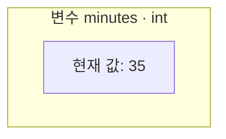
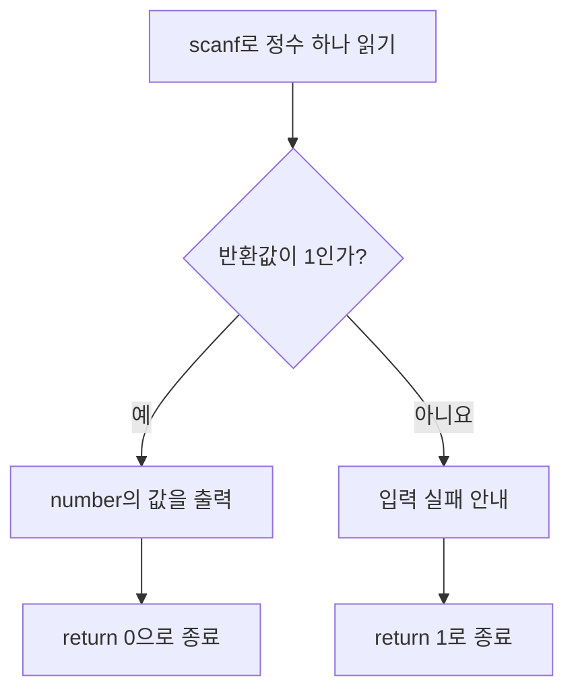

<!--
Chapter: 3 | Part: 1 | Status: Draft 1 (manager review pending)
Goal: C 소스의 구성요소를 읽고, 입력 성공 여부를 확인하는 작은 계산 프로그램을 작성한다.
Prereq secs: Ch1 §1.4 입력·처리·출력과 결과 확인; Ch2 §2.2 빌드 단계, §2.4-2.7 .c/C17/진단/실행.
Primary source [T]: 천인국, 쉽게 풀어쓴 C언어 Express 개정4판, Ch03.
  책 pp.88-120 = PDF pp.90-122 (1-based)를 렌더링하여 직접 확인.
  §3.1-3.9 책 pp.88-112를 골격으로 사용; Labs/MiniProject pp.107,113-116 및
  정리·문제 pp.117-120은 범위·독창성 점검용. 원전 §3.1/3.9 실제 제목은 '덧셈 프로그램'.
K&R refs [K]: The C Programming Language, 2nd ed., 업로드된 238쪽 OCR판.
  Ch1 도입/§1.1-1.2 PDF pp.9-15; §7.2 pp.137-138; §7.4 pp.140-142.
  과거 288쪽 스캔과 페이지 체계가 다르므로 이 페이지를 인쇄본 쪽수로 표기하지 않음.
External [E]: WG14 N1570 (C11 공개 초안, C17에서도 유지되는 main/입출력 기본 규칙 확인);
  Microsoft Learn scanf, CRT 보안 기능, C4996, /D, /std; GCC C Dialect Options.
  확인일 2026-09-30. 상세 URL 및 표준 의미 확인 자료는 HANDOFF에 기록.
Baseline: ISO C17; VS2022/MSVC primary, GCC secondary; no VLA.
Toolchains: MSVC .c /std:c17 /W4; GCC -std=c17 -Wall -Wextra.
Gap IDs: B5 scanf 반환값 확인 REQUIRED BOX; C24 C17 정책 유지.
VISUALs: 프로그램 구성 표, 함수 호출 구성 표, 변수 상자, 입력 성공/실패 흐름.
Est. pages: 16-20 (편집 전 추정) | DS-flag: 직접적인 DS 진입 단원 아님; 공통 문법 기초.
Toolchain verification (2026-09-30): GCC 13.3.0, .c -std=c17 -Wall -Wextra,
  완전한 예제 A-F 6개 빌드 PASS/경고 0; 실행 14건의 출력·종료값 PASS.
  E: 42/0/abc/입력 종료, F: 135/60/0/1440/abc/입력 종료 확인.
  MSVC는 현 Linux 환경에 없어 6개 모두 실행 미검증. 출판 전 이중 도구 검증은 미충족.
  MSVC의 기본 진단 및 /D_CRT_SECURE_NO_WARNINGS 적용 결과는 아직 PASS로 간주하지 않음.
Originality: 설명·수치·예제·도식·12문항 독자 작성. 원전의 계산기/원/환율/평균/사각형 프로그램 복제 없음.
Exercise policy: 문제와 짧은 힌트만 제공. 승인 후 별도 해설 작성; Chapter 3 해설 파일은 생성하지 않음.
Roles: 기본 / 보강 / 추가. 출처와 역할은 독립적으로 기록.
-->

# Chapter 3. C 프로그램 구성요소

## 이 장에서 배우는 것

- 최소 C 프로그램에서 헤더 포함, `main`, 중괄호, 함수 호출, 반환문의 역할을 설명한다.
- 주석과 전처리 지시문, C 문장을 구별하고 읽기 쉬운 형태로 작성한다.
- 정수 변수를 선언하고 값을 저장하며 간단한 산술식의 결과를 추적한다.
- `printf`의 형식 문자열과 값을 대응시키고, `scanf`의 입력값과 반환값을 구별한다.
- 입력 실패를 확인하는 작은 프로그램을 작성하고 C17 설정으로 빌드하여 예상 결과와 비교한다.

Chapter 2에서는 소스 파일을 실행 파일로 만드는 방법을 익혔다. 이제는 소스의 어느 부분을 고쳐야 원하는 동작이 나오는지 알아야 한다. 출력 문구를 바꾸는 데서 출발하여, 값을 저장하고 계산한 뒤 사용자에게 입력받는 프로그램까지 차례로 확장해 보자.

실습에는 Chapter 2에서 만든 C 프로젝트를 사용한다. 예제마다 `.c` 파일을 하나씩 만들어 별도로 빌드한다. `main`이 있는 예제 파일 여러 개를 같은 실행 파일에 함께 넣지는 않는다. 저장·빌드·실행 순서가 낯설다면 Chapter 2의 실습부터 다시 확인하자.

## 3.1 첫 C 프로그램을 한 줄씩 읽기

<!-- SOURCE: [T] §3.1 pp.88-89, §3.4 pp.93-95; [K] §1.1 PDF pp.9-11;
[E] N1570 §5.1.2.2.1/3, §6.7.6.3p10, §7.22.4.4p5.
ROLE: 기본 + 보강. Ch2의 최소 구조를 재사용하되 출력 맥락은 새로 설계. -->

학습 시간을 기록하는 프로그램을 만든다고 하자. 첫 단계에서는 계산 없이 준비가 되었다는 문구만 출력한다. 다음을 `ready.c`에 저장한다.

**예제 A — 안내 문구 출력**

```c
#include <stdio.h>

int main(void)
{
    printf("Study log ready.\n");
    return 0;
}
```

실행 결과는 다음과 같다. 코드의 출력 문구는 실행 환경의 한글 표시 설정에 영향을 덜 받도록 영문으로 적었다.

```text
Study log ready.
```

짧은 프로그램이지만 줄마다 역할이 다르다.

| 부분 | 읽는 방법과 역할 |
|---|---|
| `#include <stdio.h>` | 표준 입출력 기능을 사용하는 데 필요한 헤더 정보를 포함한다. |
| `int main(void)` | `main`이라는 함수의 시작 부분이다. 정수를 반환하며, 이 형태에는 매개변수가 없다. |
| `{`와 `}` | `main`의 몸체가 시작하고 끝나는 위치를 표시한다. |
| `printf("Study log ready.\n");` | `printf`를 호출하여 안내 문구와 줄바꿈을 출력한다. |
| `return 0;` | `main`을 끝내고 실행 환경에 성공을 나타내는 상태를 반환한다. |

### 실행은 main을 통해 시작한다

이 책에서 만드는 일반적인 콘솔 프로그램은 실행 환경이 **`main` 함수**를 호출하면서 우리가 작성한 작업을 시작한다. 소스 파일의 맨 윗줄부터 모든 줄을 하나씩 실행하는 것은 아니다. 첫 줄의 `#include`는 실행 전에 빌드 과정에서 처리된다.

`int main(void)`는 세 부분으로 읽는다. `main`은 시작점으로 정해진 함수 이름이다. 앞의 `int`는 이 함수가 **정수 형태의 상태값을 실행 환경에 돌려준다**는 뜻이다. 괄호 안의 `void`는 이 형태의 `main`이 매개변수, 곧 호출할 때 값을 전달받기 위한 항목을 두지 않는다는 뜻이다. 뒤에서 키보드 입력을 받는 것과는 별개의 이야기다.

이 책의 시작 형태는 `int main(void)`로 통일한다. `void main()`으로 바꾸지 않는다. `main`의 다른 형태와 명령행에서 값을 전달하는 방법은 Chapter 19에서 다룬다.

### 중괄호와 문장

`main` 다음의 여는 중괄호 `{`와 닫는 중괄호 `}` 사이가 **함수 몸체**다. 이 예제에서는 그 안에서 출력한 뒤 종료한다. 처리할 작업을 나타내는 C의 문법 단위를 **문장(statement)**이라고 한다. `printf(...);`와 `return 0;`은 각각 문장이다.

이 두 문장 끝의 세미콜론 `;`은 장식이 아니다. 문장이 끝나는 위치를 나타내므로 줄을 바꾸는 것만으로 대신할 수 없다. 다만 모든 C 문장이 세미콜론으로 끝나는 것은 아니다. 뒤에서 만날 중괄호로 묶은 형태도 있으므로, 지금은 **이 예제의 함수 호출문과 반환문에는 세미콜론이 필요하다**고 기억하자. `int main(void)` 뒤나 함수 몸체의 닫는 중괄호 뒤에는 세미콜론을 덧붙이지 않는다.

들여쓰기는 포함 관계를 사람이 읽기 쉽게 드러낸다. 이 책은 중괄호 안을 네 칸 들여쓰고, 짧은 문장도 되도록 한 줄에 하나씩 적는다. 소스의 줄바꿈과 화면의 줄바꿈은 다르다. 화면에서 줄을 바꾸는 표기 `\n`은 3.7절에서 살펴본다.

### return 0은 화면에 0을 출력하지 않는다

`return`은 함수를 끝내면서 값을 돌려주는 C의 키워드다. 여기서 **반환(return)**은 화면 출력과 다르다. `return 0;`의 0은 콘솔에 나타나는 숫자가 아니라, 프로그램의 종료 상태로 실행 환경에 전달된다. `main`에서 0을 반환하면 성공적인 종료를 뜻한다.

그렇다고 프로그램이 자기 결과의 정확성을 증명한 것은 아니다. 잘못된 문구를 출력해 놓고도 `return 0;`에 도달할 수 있다. Chapter 2에서 배웠듯이 실행 결과는 기대한 결과와 따로 비교해야 한다.

## 3.2 주석

<!-- SOURCE: [T] §3.2 pp.89-92; [K] §1.2 PDF pp.12-13. ROLE: 기본. -->

소스 코드는 컴퓨터가 처리할 내용과 사람이 이해할 설명을 함께 담을 수 있다. **주석(comment)**은 코드의 목적이나 판단 근거를 적는 부분이다. 주석 자체는 실행할 명령이 되지 않는다.

### 한 줄 주석과 블록 주석

다음은 예제 A의 출력문에 붙일 수 있는 한 줄 주석이다. 아래와 같이 `main` 안에서 사용하는 일부 코드는 **코드 조각**이며, 그 자체로 완전한 프로그램은 아니다.

```c
// 입력을 받기 전에 프로그램이 시작되었음을 알린다.
printf("Study log ready.\n");
```

`//`부터 그 줄 끝까지가 주석이다. 문장 뒤에도 붙일 수 있다. C17에서는 이 형태를 사용할 수 있다.

`/*`와 `*/`로 둘러싸는 **블록 주석**은 여러 줄에 걸쳐 쓸 수 있다.

```c
/* 학습 시간을 분 단위로 기록한다.
   출력할 때 시간과 남은 분으로 나누어 보여 줄 예정이다. */
```

블록 주석은 첫 번째 `*/`에서 끝난다. 그 안에 또 다른 `/* ... */` 주석을 중첩해서 넣지 않는다. 닫는 `*/`를 빠뜨리면 뒤의 코드까지 주석으로 읽히거나 주석이 끝나지 않았다는 진단이 나온다.

### 코드보다 의도를 설명한다

`printf` 옆에 “출력한다”라고만 적으면 코드가 이미 알려 주는 내용을 반복한다. 반면 “입력을 받기 전에 시작되었음을 알린다”라는 설명은 그 출력문이 필요한 이유를 알려 준다. 짧고 분명한 코드에는 주석을 억지로 붙일 필요가 없다.

주석과 코드가 어긋나면 읽는 사람은 무엇을 믿어야 할지 알 수 없다. 코드를 바꿀 때는 관련 주석도 함께 확인한다. 주석이 아무리 자세해도 잘못된 코드를 올바르게 만들지는 못한다.

## 3.3 전처리 지시문과 #include

<!-- SOURCE: [T] §3.3 pp.92-93; [K] §1.1 PDF p.10; Ch2 §2.2.
ROLE: 기본 + 보강. 원전의 헤더 안 '정의' 설명은 사용에 필요한 선언·정보로 보정. -->

`printf`를 사용하려면 컴파일러도 그 이름과 사용 규칙을 알아야 한다. 그 정보를 준비하는 줄이 `#include <stdio.h>`다.

**전처리 지시문(preprocessing directive)**은 본격적인 컴파일에 앞서 소스를 어떻게 준비할지 지시하며, `#`으로 시작한다. Chapter 2에서 배운 전처리 단계와 연결된다. 이 장에서는 다음 형태만 사용한다.

```c
#include <stdio.h>
```

`stdio.h`는 표준 입출력에 관한 **헤더(header)**다. 헤더에는 `printf`, `scanf` 같은 기능을 사용하기 위한 선언과 정보가 제공된다. 선언은 컴파일러에게 이름과 사용 규칙을 알려 주는 역할을 한다. `#include`는 이러한 헤더 내용을 소스의 해당 위치에 포함하도록 지시한다.

“헤더를 포함한다”와 “필요한 라이브러리 구현을 연결한다”는 같은 일이 아니다. 전자는 번역에 필요한 정보를 준비하는 일이고, 후자는 Chapter 2에서 살펴본 링크와 관련된다. `stdio.h`를 `printf` 구현 자체가 들어 있는 파일이라고 외우지 말자.

### 지시문과 문장을 구별한다

| 코드 | 종류 | 처리되는 때 | 끝 표기 |
|---|---|---|---|
| `#include <stdio.h>` | 전처리 지시문 | 빌드 중 전처리 단계 | 이 형태에는 `;`를 붙이지 않는다. |
| `printf("Ready.\n");` | 함수 호출을 하는 문장 | 프로그램 실행 중 | `;`로 끝난다. |
| `return 0;` | 반환문 | 프로그램 실행 중 | `;`로 끝난다. |

소스 파일에 적힌 한 줄이 모두 같은 종류의 명령은 아니다. 특히 `#include`를 함수 몸체의 첫 번째 실행문으로 해석하면 안 된다. 다른 전처리 지시문과 복잡한 사용법은 Chapter 20에 남겨 둔다.

## 3.4 함수와 함수 호출 미리보기

<!-- SOURCE: [T] §3.4 pp.93-95, §3.7 pp.104-105; [K] §1.1 PDF pp.10-11,
§7.2 PDF p.137, §7.4 PDF p.140; [E] N1570 §7.21.6.3-4.
ROLE: 기본 + 보강. 함수 정의의 상세 규칙은 Ch8. -->

화면에 글자를 표시하려고 매번 출력 기능의 내부부터 작성할 필요는 없다. 이미 준비된 기능에 일을 요청할 수 있다. **함수(function)**는 특정 작업을 수행하도록 이름 붙인 코드 단위다. 함수를 사용하여 그 작업을 수행하게 하는 것이 **함수 호출(function call)**이다.

`printf`는 C 표준 라이브러리가 제공하는 **라이브러리 함수**다. 예제 A에서 호출한 부분을 나누어 보자.

| 구성 | 해당 코드 | 역할 |
|---|---|---|
| 함수 이름 | `printf` | 사용할 함수를 고른다. |
| 괄호 | `( ... )` | 호출할 때 전달할 항목을 둘러싼다. |
| 인수 | `"Study log ready.\n"` | 출력할 내용을 함수에 전달한다. |
| 세미콜론 | `;` | 이 호출을 수행하는 문장을 끝낸다. |

**인수(argument)**는 함수를 호출할 때 전달하는 값이다. 이 호출에서는 큰따옴표로 둘러싼 문자열 하나를 전달한다. 여러 인수를 전달할 때는 쉼표로 구분한다. 어떤 인수를 몇 개 전달할 수 있는지는 함수의 사용 규칙에 따라 다르다.

`main`의 몸체를 적는 것은 함수를 만드는 쪽이고, 그 안에서 `printf(...)`를 쓰는 것은 준비된 함수를 호출하는 쪽이다. 지금은 이 차이와 호출을 읽는 방법에 집중한다. 직접 함수를 나누어 만드는 방법은 Chapter 8에서 배운다.

### 인수와 반환값은 방향이 다르다

함수는 전달받은 인수로 작업을 하고, 그 결과에 관한 값을 호출한 쪽에 돌려줄 수 있다. 이를 **반환값(return value)**이라고 한다.

| 구분 | 전달 방향 | 이 장에서의 예 |
|---|---|---|
| 인수 | 호출하는 쪽 → 호출되는 함수 | `printf`에 주는 출력 문구 |
| 반환값 | 호출된 함수 → 호출한 쪽 | `scanf`가 알려 주는 입력 성공 개수 |

출력 함수라고 해서 반환값이 없는 것은 아니다. `printf`도 정상적으로 출력하면 출력한 문자 수를 반환하고, 출력 오류가 나면 음수를 반환한다. 이 장의 작은 콘솔 예제는 출력 장치가 정상이라고 가정하여 그 값을 사용하지 않는다. 반면 사용자 입력은 숫자 대신 글자가 들어오는 일이 흔하므로, `scanf`의 반환값은 첫 입력 예제부터 확인한다.

## 3.5 변수의 첫 사용

<!-- SOURCE: [T] §3.5 pp.96-101, §3.6 pp.101-102; [K] §1.2 PDF pp.12-14.
ROLE: 기본. 자료형·이름 규칙·저장 공간의 상세 내용은 Ch4로 유보. -->

매번 정해진 문구만 출력해서는 학습 시간을 기록할 수 없다. 숫자를 보관해 두고 필요할 때 꺼내 쓰려면 **변수(variable)**가 필요하다. 변수는 값을 저장하는 공간에 이름을 붙인 것이다. 이 장에서는 정수를 저장하는 `int`형 변수를 사용한다.

**예제 B — 변수에 저장한 시간 출력 (`minutes.c`)**

```c
#include <stdio.h>

int main(void)
{
    int minutes = 35;
    printf("Study: %d min\n", minutes);
    return 0;
}
```

```text
Study: 35 min
```

`int minutes = 35;`는 `minutes`라는 이름의 정수 변수를 만들고 처음 값으로 35를 저장한다. `printf`의 `%d` 자리에는 `minutes`의 현재 값이 정수로 출력된다. 형식 지정자는 3.7절에서 자세히 살펴본다.

### 선언과 초기화

변수를 쓰려면 그 이름과 자료형을 먼저 알려야 한다. 이를 **선언(declaration)**이라고 한다. `int minutes;`는 `minutes`를 정수 변수로 선언한다. 선언하면서 처음 값을 주는 것을 **초기화(initialization)**라고 하며, 예제 B의 `= 35`가 그 부분이다.

이 변수는 다음처럼 이름이 붙은 상자로 생각할 수 있다.



그림은 이름과 현재 값의 관계를 이해하기 위한 모델이다. 실제 메모리의 크기나 주소를 나타내지는 않는다. `int`가 저장할 수 있는 범위와 다른 자료형은 Chapter 4에서 다룬다.

`main` 안에서 `int minutes;`라고만 선언했다고 값이 자동으로 0이 되는 것은 아니다. **처음 값을 저장하기 전에는 그 변수를 출력하거나 계산에 사용하지 않는다.** 이 장에서는 직접 초기화하거나, 뒤에서 배울 입력의 성공을 확인한 다음에 사용한다.

### 대입으로 값을 바꾼다

이미 선언한 변수에 값을 저장하는 연산을 **대입(assignment)**이라고 한다. 예제 B의 선언 다음에 아래 문장을 넣으면 `minutes`의 값이 바뀐다.

```c
minutes = 50;
```

`=`는 오른쪽 값을 왼쪽 변수에 저장한다. 수학에서 쓰는 “양쪽이 같다”라는 주장으로 읽지 않는다. 한 번 50을 저장하면 현재 값은 50이며, 이전 값 35가 자동으로 따로 보관되는 것은 아니다.

다음은 `main` 안에서 실행할 수 있는 코드 조각이다.

```c
int planned = 35;
int actual = planned;
planned = 50;
```

| 처리한 부분 | `planned` | `actual` |
|---|---:|---:|
| 첫 번째 선언·초기화 | 35 | 아직 선언 전 |
| 두 번째 선언·초기화 | 35 | 35 |
| 마지막 대입 | 50 | 35 |

`actual`은 초기화할 당시의 `planned` 값을 받는다. 두 변수가 이후에도 같은 값을 유지하도록 연결되는 것은 아니다.

변수 이름은 `minutes`, `planned`처럼 역할을 드러내게 짓는다. 이 장에서는 영문 소문자로 시작하고, 여러 단어는 `total_minutes`처럼 밑줄로 연결한다. C는 대소문자를 구별하므로 `minutes`와 `Minutes`는 서로 다른 이름이다. 이름에 관한 전체 규칙은 Chapter 4에서 정리한다.

## 3.6 수식과 연산 미리보기

<!-- SOURCE: [T] §3.6 pp.101-103; [K] §1.2 PDF pp.13-15.
ROLE: 기본 + 보강. 양의 정수 /와 %를 시간 분해 사례로 설명; 상세 규칙은 Ch5. -->

학습 시간이 135분이라고 하자. 숫자 그대로도 쓸 수 있지만, 2시간 15분으로 보여 주면 더 빨리 읽을 수 있다. 변수에 저장한 값으로 계산하려면 **수식(expression)**을 작성한다. 수식은 값, 변수, 연산자 등을 조합하여 값을 구하는 표현이다. `minutes + 10`, `total_minutes / 60`이 그 예다.

**연산자(operator)**는 어떤 계산을 할지 나타내는 기호다. 계산에 참여하는 값을 피연산자라고 한다. 이 장에서 사용할 산술 연산자는 다음 다섯 가지다.

| 계산 | C 연산자 | 간단한 식 | 결과 |
|---|---|---|---:|
| 더하기 | `+` | `18 + 7` | 25 |
| 빼기 | `-` | `18 - 7` | 11 |
| 곱하기 | `*` | `6 * 4` | 24 |
| 정수 나눗셈 | `/` | `17 / 5` | 3 |
| 정수 나머지 | `%` | `17 % 5` | 2 |

곱셈은 `×`가 아니라 `*`로 쓴다. `6 * 4`에서 `*`가 연산자이고 6과 4가 피연산자다. 식의 값을 변수에 저장할 때는 `int total = 6 * 4;`처럼 선언과 초기화를 함께 쓸 수 있다.

### 정수 나눗셈은 소수 결과를 보관하지 않는다

두 정수를 `/`로 나누면 정수 몫을 구하며 소수 부분은 버린다. 따라서 `17 / 5`는 3이다. 3.4를 반올림하는 계산이 아니다. 정수 나머지 연산 `17 % 5`는 2이고, 이 사례에서는 `17 = 5 × 3 + 2`라는 관계가 성립한다.

여기서는 0 이상의 정수를 양의 정수로 나누는 경우만 사용한다. `/`와 `%`의 오른쪽에 0을 쓰지 않는다. 음수가 포함되는 연산과 자료형에 따른 계산 규칙은 Chapter 5에서 자세히 다룬다.

**예제 C — 분을 시간과 분으로 나누기 (`split_time.c`)**

```c
#include <stdio.h>

int main(void)
{
    int total_minutes = 135;
    int hours = total_minutes / 60;
    int minutes = total_minutes % 60;
    printf("%d h %d min\n", hours, minutes);
    return 0;
}
```

```text
2 h 15 min
```

1시간은 60분이므로, 135 안에 온전히 들어가는 60의 개수는 2다. `hours`에는 2가 저장된다. 60분씩 두 번 나누고 남은 15는 `minutes`에 저장된다. 몫과 나머지가 서로 다른 질문에 답한다는 점에 주목하자.

계산 결과를 저장한 뒤 `printf`로 출력한다. **계산식과 출력 형식은 별개**다. 정수 계산을 했는데 화면에 소수점만 붙인다고 사라진 소수 부분이 복구되지는 않는다.

복잡한 식을 한 줄에 몰아넣을 필요는 없다. 이 장에서는 필요한 중간값에 이름을 붙여 처리 순서를 드러낸다. 여러 연산자를 섞을 때의 우선순위와 결합 규칙은 Chapter 5에서 정리한다.

## 3.7 printf()로 출력하기

<!-- SOURCE: [T] §3.7 pp.104-107; [K] §7.2 PDF pp.137-138; [E] N1570 §7.21.6.1/3.
ROLE: 기본 + 보강. 원전 표의 %f 출력은 기본 소수점 이하 6자리로 보정.
형식 불일치 코드는 실행하지 않으며, 문자열은 리터럴 사용에 한정. -->

예제 B에서는 숫자 하나를, 예제 C에서는 두 개를 출력했다. 두 경우 모두 `printf`의 첫 번째 인수가 출력의 모양을 정한다. 이것을 **형식 문자열(format string)**이라고 한다.

```c
printf("Study: %d min\n", minutes);
```

형식 문자열의 보통 글자인 `Study: `와 ` min`은 그대로 출력된다. **형식 지정자(format specifier)** `%d`는 뒤에 전달한 `int` 값을 10진수 정수로 표시할 자리다. `minutes`라는 이름 자체가 출력되는 것은 아니다.

| 코드의 부분 | 뜻 |
|---|---|
| `printf` | 호출할 함수 이름 |
| `"Study: %d min\n"` | 첫 번째 인수: 출력 모양을 정하는 형식 문자열 |
| `minutes` | 두 번째 인수: `%d`에 대응하는 값 |

### 형식과 값을 순서대로 대응시킨다

예제 C의 `printf("%d h %d min\n", hours, minutes);`에는 `%d`가 두 개 있다. 첫 번째는 `hours`, 두 번째는 `minutes`에 대응한다. 값을 전달하는 순서가 바뀌면 표시되는 내용도 바뀐다.

다음 네 가지 형식을 우선 익히자. 아래 표는 **`printf`의 출력 형식**에 관한 표다.

| 형식 | 용도 | 이 장에서 전달할 값의 예 | 출력 예 |
|---|---|---|---|
| `%d` | `int` 값을 10진수로 출력 | `35` | `35` |
| `%f` | `double` 값을 소수점 형태로 출력 | `1.5` | `1.500000` |
| `%c` | 문자 하나를 출력 | `'B'` | `B` |
| `%s` | 문자열을 출력 | `"Review"` | `Review` |

`1.5`처럼 소수점이 있고 별도 접미사가 없는 수는 여기서 `double`형 값이다. 지금은 `%f`와 짝지어 사용하고, 실수 자료형의 차이는 Chapter 4에서 배운다. `%f`는 별도 정밀도를 지정하지 않으면 소수점 이하 여섯 자리를 표시한다.

`'B'`는 작은따옴표로 둘러싼 문자이고, `"Review"`는 큰따옴표로 둘러싼 문자열이다. 문자열의 내부 저장 방식은 Chapter 14에서 다룬다. 지금은 출력할 글자를 직접 적은 문자열을 사용할 수 있으면 충분하다.

**예제 D — 여러 종류의 값 출력 (`formats.c`)**

```c
#include <stdio.h>

int main(void)
{
    printf("Sessions: %d\n", 3);
    printf("Hours: %f\n", 1.5);
    printf("Group: %c\n", 'B');
    printf("Topic: %s\n", "Review");
    return 0;
}
```

```text
Sessions: 3
Hours: 1.500000
Group: B
Topic: Review
```

`%d`에 정수를, `%f`에 그 형식에 맞는 실수 값을 전달하는 식으로 **형식과 값의 종류를 맞춰야 한다**. `%f`를 쓴다고 정수 인수가 자동으로 알맞은 실수 인수가 되는 것은 아니다. 필요한 값을 빠뜨리거나 맞지 않는 종류를 전달한 코드는 출력 결과를 믿을 수 없으며, 경고가 나면 실행 전에 고친다.

### 줄바꿈은 \n으로 지정한다

`\n`은 줄바꿈 문자를 나타내는 **이스케이프 시퀀스(escape sequence)**다. 소스에는 역슬래시와 `n` 두 글자로 적지만, 문자열에서는 하나의 줄바꿈 문자를 뜻한다. `/n`과 혼동하지 않는다.

다음 코드 조각은 세 번 호출하지만 출력은 한 줄로 이어진다.

```c
printf("Study ");
printf("starts");
printf(" now.\n");
```

출력은 `Study starts now.` 뒤에서 줄이 바뀐다. `printf`는 호출이 끝났다는 이유만으로 줄바꿈을 덧붙이지 않는다. 또한 문자열 안에서 `%` 글자 자체를 출력하려면 `%%`를 쓴다. 예를 들어 형식 문자열 `"Progress: 50%%\n"`은 `Progress: 50%`와 줄바꿈을 출력하며, 이 `%%`에는 별도 값 인수가 필요하지 않다.

## 3.8 scanf()로 입력받기

<!-- SOURCE: [T] §3.8 pp.108-111; [K] §7.4 PDF pp.140-142;
[E] N1570 §7.21.6.2p10, §7.21.6.4; Microsoft scanf/CRT/C4996 문서;
04:B5 REQUIRED BOX. ROLE: 기본 + 보강 + 추가.
읽기 대상은 int 하나로 제한; %s 입력·float 입력·반복 복구는 다루지 않음. -->

예제 C는 학습 시간이 항상 135분으로 정해져 있다. 시간을 바꿀 때마다 소스를 고치고 다시 빌드하는 대신, 실행 중에 값을 입력받을 수 있다.

**`scanf`**는 입력된 글자를 지정한 형식에 따라 해석하여 변수에 저장하는 표준 라이브러리 함수다. 이번 콘솔 실습에서는 키보드로 정수를 입력하고 Enter를 누른다. `printf`와 마찬가지로 사용 전에 `stdio.h`를 포함한다.

먼저 정수 하나를 받아 그대로 표시해 보자. 숫자 대신 `abc`를 입력하면 계산을 계속하지 않고 입력 실패를 알린다.

**예제 E — 입력 성공을 확인하고 출력 (`read_number.c`)**

```c
#include <stdio.h>

int main(void)
{
    int number;
    printf("Enter an integer:\n");
    if (scanf("%d", &number) != 1)
    {
        printf("Input failed.\n");
        return 1;
    }
    printf("Read: %d\n", number);
    return 0;
}
```

예를 들어 입력을 `42`로 주면 다음 순서로 표시된다. 가운데 `42`는 사용자가 입력한 내용이다.

```text
Enter an integer:
42
Read: 42
```

새로 실행해서 `abc`를 입력하면 다음과 같다.

```text
Enter an integer:
abc
Input failed.
```

### %d와 &number의 역할

`scanf("%d", &number)`의 `%d`는 입력을 10진수 정수로 해석하라는 뜻이다. `&number`는 **그 정수를 저장할 변수의 위치**를 알려 준다.

`printf("%d\n", number);`에서는 이미 저장된 값을 꺼내 출력한다. 반면 `scanf`는 새 값을 변수에 써 넣어야 하므로, 이 호출에서는 값 자체 대신 저장할 위치를 전달한다.

| 호출에서 쓰는 표현 | 이 예제에서 전달하는 것 |
|---|---|
| `printf`의 `number` | 변수에 저장된 현재 값 |
| `scanf`의 `&number` | 입력값을 저장할 변수의 위치 |

`&`를 “입력하라는 기호”라고 외우면 안 된다. 여기서 `&`는 변수의 주소를 구하는 연산자다. 주소와 포인터의 정확한 의미는 Chapter 12에서 배운다. 지금은 **정수 변수 `number`에 `%d`로 입력받는 이 호출에 `&number`가 필요하다**는 정도로 이해하자. 이 규칙을 모든 입력 대상에 무조건 확대하지 않는다.

### 필수 확인: scanf의 반환값은 입력한 숫자가 아니다

> **입력 성공 여부를 반드시 확인한다**
>
> `scanf`의 반환값은 요청한 입력 항목 중 **변환하여 변수에 저장하는 데 성공한 항목의 개수**다. 이 예제는 `%d` 하나를 요청하므로 성공하면 1을 반환한다. 입력 숫자가 42여도 반환값은 42가 아니라 1이다.
>
> 첫 입력이 `abc`라서 정수로 읽지 못하면 반환값은 0이며, `number`에는 새 값이 저장되지 않는다. 값을 읽기 전에 입력 자체가 끝나는 경우에도 성공값 1이 아니다. 따라서 여기서는 반환값이 **1이 아닌 모든 경우**를 실패로 처리한다.
>
> 입력에 실패했다면 `number`를 계산이나 출력에 사용하지 않는다. 처음 값을 0으로 넣어 두는 것만으로는 실패 확인을 대신할 수 없다. 실제로 입력한 0과 읽기에 실패한 상태는 다르다.

반환값을 확인하는 코드의 흐름을 읽어 보자.



`if`는 조건에 따라 중괄호 안의 작업을 수행하게 하는 문장이고, `!=`는 “같지 않다”라는 비교다. `if (scanf("%d", &number) != 1)`은 다음 순서로 읽는다.

1. `scanf`를 한 번 호출하여 입력을 시도한다.
2. 그 호출이 돌려준 값을 1과 비교한다.
3. 1이 아니면 중괄호 안의 실패 안내와 `return 1;`을 수행한다.
4. 1이면 실패 처리 부분을 건너뛰고 `number`를 출력한다.

`return 1;`은 이 예제에서 실패를 알리고 `main`을 끝내기 위한 표기다. 따라서 실패 안내 뒤에는 `Read: ...`가 출력되지 않는다. 0은 표준에서 성공을 뜻하며, 실패 상태로 1을 사용하는 것은 이 책의 MSVC/GCC 실습 환경에서 따르는 관례다. 종료 상태의 더 일반적인 사용법은 Chapter 19에서 다룬다.

조건문 전체는 Chapter 6에서 배운다. 여기서는 입력 실패 후에 값을 사용하지 않도록 막는 이 짧은 형태만 익힌다. **숫자를 읽었다는 사실을 확인한 다음에 그 숫자를 사용한다**는 순서가 핵심이다.

### 이 입력 예제가 확인하는 범위

실습에는 `int`에 들어갈 수 있는 작은 정수, 예를 들어 0부터 1000 사이의 수를 사용한다. 반환값 확인은 변환과 저장의 성공을 확인하지만, 입력 한 줄 전체가 요구에 맞다는 보장은 아니다. 가령 `42abc`는 앞의 42를 정수로 읽는 데 성공할 수 있다. 아주 큰 수의 범위 초과도 이 패턴만으로 안전하게 검사할 수 없다.

이 장의 예제는 정수를 읽지 못하면 안내하고 종료하는 연습용 프로그램이다. 잘못된 입력을 다시 받는 반복 처리나 한 줄 전체와 수의 범위를 엄격히 검사하는 방법은 아직 포함하지 않는다. 실전 입력 처리는 Chapter 14에서 확장한다. `printf`와 `scanf`의 형식 지정자 규칙도 완전히 같지는 않으므로, 여기서 배운 `%f` 출력 규칙을 다른 자료형의 입력에 그대로 적용하지 않는다.

### Visual Studio 2022에서 C4996을 만났다면

<!-- SOURCE: [E] Microsoft Learn scanf, Security Features in the CRT, C4996, /D.
ROLE: 추가. 아래 명령은 문서에 근거한 실행 안내이며, 이번 환경의 MSVC 실측 로그가 아님. -->

> **표준 함수와 도구 설정을 구분한다**
>
> Chapter 2에서 예고했듯이 MSVC는 `scanf`에 C4996 진단을 낼 수 있다. `/sdl` 설정에서는 오류가 될 수도 있다. 이것은 Microsoft CRT의 보안 정책이며, ISO C에서 `scanf` 사용을 금지한다는 뜻이 아니다. `scanf_s`가 모든 환경에서 사용해야 하는 표준 대체 함수인 것도 아니다.
>
> 이 장은 같은 ISO C 소스를 유지하기 위해, 해당 입력 실습을 빌드할 때 MSVC 설정에 `_CRT_SECURE_NO_WARNINGS`를 정의하는 방법을 사용한다. 프로젝트 속성의 **C/C++ → 전처리기 → 전처리기 정의**에 추가하되 기존 정의는 보존한다. 메뉴 이름이나 위치는 버전·업데이트·표시 언어에 따라 조금 달라질 수 있다.
>
> 명령줄에서는 다음처럼 `/D` 옵션으로 지정한다. 소스 본문은 변경하지 않는다.
>
> ```text
> cl /std:c17 /W4 /D_CRT_SECURE_NO_WARNINGS read_number.c
> ```
>
> 이 정의는 CRT의 해당 사용 중단 경고를 숨길 뿐 입력 검사를 추가하지 않는다. 적용 범위도 이 입력 실습에 한정한다. `/W4`는 유지하고, 다른 경고는 원인을 확인한다. 모든 프로젝트의 경고를 한꺼번에 끄거나 반환값 검사를 지우는 해결책으로 받아들이지 말자.

GCC에서는 이 MSVC용 정의 없이 빌드한다.

```text
gcc -std=c17 -Wall -Wextra read_number.c -o read_number
```

## 3.9 작은 프로그램 완성하기

<!-- SOURCE: [T] §3.9 pp.111-112, Labs/MiniProject pp.113-116의 입력-처리-출력 통합 목적;
[K] Ch1 도입의 점진적 실습, §7.4 반환값 확인; [E] B5.
ROLE: 기본 + 보강. 학습 시간 기록 맥락과 수치·프로그램은 독자 설계. -->

이제 예제 C의 고정된 학습 시간을 입력으로 바꿀 수 있다. 새 문법을 많이 추가하는 대신, 앞에서 배운 조각을 연결해 보자.

### 무엇을 받아 무엇을 표시할까?

**문제:** 하루의 학습 시간을 분 단위로 받아, 온전한 시간 수와 남은 분을 표시한다. 실습 입력은 0부터 1440까지의 정수로 정한다. 정수로 읽지 못하면 계산하지 않고 종료한다. 이 짧은 예제에서는 정수로 읽힌 뒤의 범위 검사는 생략하며, 사용자가 정한 범위 안에서 입력한다고 가정한다.

| 단계 | 처리할 내용 |
|---|---|
| 입력 | 학습 시간 `total_minutes`를 정수 하나로 읽고 성공 여부를 확인한다. |
| 계산 | 60으로 나눈 몫을 `hours`, 나머지를 `minutes`에 저장한다. |
| 출력 | 두 값을 `h`, `min`이라는 단위와 함께 표시한다. |

135분이라면 `2 h 15 min`, 60분이라면 `1 h 0 min`이 나와야 한다. 실행하기 전에 이렇게 예상값을 정해 둔다.

**예제 F — 학습 시간 기록 (`study_time.c`)**

```c
#include <stdio.h>

int main(void)
{
    int total_minutes;
    printf("Study minutes (0-1440):\n");
    if (scanf("%d", &total_minutes) != 1)
    {
        printf("Input failed.\n");
        return 1;
    }
    int hours = total_minutes / 60;
    int minutes = total_minutes % 60;
    printf("Study: %d h %d min\n", hours, minutes);
    return 0;
}
```

```text
Study minutes (0-1440):
135
Study: 2 h 15 min
```

이 프로그램에서 `hours`와 `minutes`의 선언은 입력 확인 다음에 있다. C17에서는 이처럼 앞선 문장 뒤에도 변수를 선언할 수 있다. 다만 그 변수를 사용하는 곳보다 먼저 선언해야 한다.

### 성공한 경우와 실패한 경우를 각각 따라간다

입력이 135라면 `scanf`가 `total_minutes`에 135를 저장하고 1을 반환한다. 실패 처리 부분을 건너뛴 뒤, 몫 2와 나머지 15를 계산한다. 두 값을 출력하고 0을 반환한다.

입력이 `abc`라면 `scanf`는 정수를 저장하지 못하고 0을 반환한다. 실패 처리의 중괄호 안으로 들어가 `Input failed.`를 출력한 뒤 1을 반환하며 끝난다. 따라서 값을 받지 못한 `total_minutes`로 나눗셈을 하지 않는다.

이 실패는 소스를 컴파일할 수 없는 문제가 아니다. 실행이 시작된 뒤 입력이 맞지 않아 요청한 계산을 진행하지 못한 경우이며, 프로그램은 미리 정한 방식으로 안내하고 종료한다. 실패를 처리한다고 해서 반드시 프로그램이 비정상 종료되어야 하는 것은 아니다.

### 빌드와 결과를 함께 확인한다

Visual Studio 2022에서는 `.c`, C17, `/W4` 설정을 유지하고, 이 입력 예제에만 앞 절의 CRT 설정을 적용한다. 명령줄 안내는 다음과 같다.

```text
MSVC 개발자 명령 프롬프트
    cl /std:c17 /W4 /D_CRT_SECURE_NO_WARNINGS study_time.c

GCC
    gcc -std=c17 -Wall -Wextra study_time.c -o study_time
```

다음 입력은 각각 프로그램을 새로 실행해서 시험한다. 빌드 성공뿐 아니라 실제 출력이 예상과 맞는지도 확인한다.

| 입력 | 예상 결과 | 확인하는 점 |
|---|---|---|
| `135` | `Study: 2 h 15 min` | 몫과 나머지가 모두 있는 경우 |
| `60` | `Study: 1 h 0 min` | 나누어떨어지는 경우 |
| `0` | `Study: 0 h 0 min` | 입력 숫자가 0이어도 입력 성공이라는 점 |
| `1440` | `Study: 24 h 0 min` | 실습에서 정한 가장 큰 입력 |
| `abc` | 입력 안내 뒤 `Input failed.`를 표시하고 계산 결과는 표시하지 않음 | 입력 실패 뒤 값을 사용하지 않는지 |

프로그램의 계산 흐름과 허용 입력 조건을 설명할 수 있다면, 각 줄을 외우는 단계를 넘어선 것이다. 이후 자료형과 연산자를 더 배우더라도 입력·처리·출력과 실패 확인이라는 뼈대는 계속 사용한다.

## 자주 하는 실수

<!-- SOURCE: [T] Ch03, [K] §1.1/7.2/7.4; [E] CRT 문서. ROLE: 보강.
위험한 형식 불일치·& 누락 예제는 실행 실험으로 제시하지 않음. -->

| 실수 | 왜 문제가 되는가? | 확인하거나 고칠 점 |
|---|---|---|
| 호출문 끝의 `;`를 빠뜨림 | 줄바꿈은 문장 종료 표시를 대신하지 못한다. | 보고된 줄과 그 앞줄의 세미콜론을 확인한다. |
| `#include` 뒤에 `;`를 붙임 | 전처리 지시문을 실행문과 혼동했다. | `#include <stdio.h>` 형태를 유지한다. |
| `void main()`으로 시작함 | 이 책의 표준 시작 형태와 반환 규칙을 따르지 않는다. | `int main(void)`와 적절한 반환문을 쓴다. |
| `printf`의 문구를 따옴표 없이 적음 | 글자를 문자열로 표시하지 않았다. | 형식 문자열을 큰따옴표로 둘러싼다. |
| `%f`에 정수를 주면 실수로 바뀐다고 생각함 | 형식 지정자는 전달한 인수의 종류를 임의로 바꾸지 않는다. | 지정자와 값의 종류, 개수, 순서를 맞춘다. |
| 정수 입력에서 `&number`의 `&`를 빠뜨림 | 값을 저장할 올바른 위치를 전달하지 못한다. | `%d`와 대응하는 `int` 변수의 주소를 전달한다. 경고를 무시하고 실행하지 않는다. |
| `scanf` 반환값을 확인하지 않음 | 입력에 실패한 뒤에도 값을 사용하게 된다. | 정수 하나의 입력 성공값 1을 확인한다. |
| `scanf` 반환값 0을 “숫자 0을 읽었다”로 해석함 | 읽은 값과 성공 개수를 혼동했다. | 입력된 값은 변수에, 성공 개수는 반환값에 있다는 점을 구별한다. |
| `/*` 주석의 끝을 빠뜨리거나 중첩함 | 주석의 범위가 의도와 달라진다. | 첫 `*/`에서 끝나는지 확인한다. |
| C 소스를 `.cpp`로 저장함 | C++ 규칙으로 검사될 수 있다. | Chapter 2처럼 `.c` 확장자를 확인한다. |

## 핵심 정리

<!-- SOURCE: [T] Ch03; [K] §1.1-1.2/7.2/7.4; [E] B5/CRT. ROLE: 기본. -->

- `int main(void)`는 이 책의 시작 형태다. `main`은 정수 상태를 반환하며, `return 0;`은 성공 종료를 나타낸다.
- `#include <stdio.h>`는 입출력 함수의 사용에 필요한 헤더 정보를 포함하는 전처리 지시문이다. 실행 중 수행하는 함수 호출문과 구별한다.
- `//`와 `/* ... */`는 사람이 읽을 설명을 적는다. 좋은 주석은 코드의 의도를 보완하며, 블록 주석은 중첩하지 않는다.
- 함수 호출은 함수 이름과 괄호 안의 인수로 읽는다. 인수는 호출할 때 전달하고, 반환값은 호출 결과로 돌려받는다. 반환과 화면 출력은 다르다.
- 변수는 이름 붙은 저장 공간이다. 사용 전에 선언하고, 값을 저장한 뒤 읽는다. 대입은 오른쪽 값을 왼쪽 변수에 저장한다.
- 산술식으로 계산한 값을 저장하고 `printf`로 출력한다. 정수 `/`는 정수 몫을, `%`는 나머지를 구한다. 출력 지정자와 값의 종류·순서를 맞춘다.
- `scanf`에서 `&number`는 저장할 위치를 알려 준다. 정수 하나의 입력 성공은 반환값 1로 확인하고, 실패한 경우 그 변수를 사용하지 않는다.

## 확인 문제

<!-- SOURCE: [T] Ch03 학습 범위; [K] §7.2/7.4의 입출력 구분; [E] B5.
ROLE: 추가. 12문항 모두 독자 작성. 원전의 문장·코드·선택지 복제 없음.
코드 조각은 별도 표시; 수정 문제의 잘못된 코드는 실행 대상이 아님. -->

### 1. 프로그램의 구성요소 설명하기

예제 A에서 전처리 지시문, 함수 이름, 함수 몸체, 함수 호출문, 반환문을 각각 찾아라. `int main(void)`의 `int`와 `void`가 뜻하는 바를 한 문장씩 설명하라. 이어서 `return 0;`이 화면에 0을 표시하는 코드인지 설명하라.

### 2. 의도가 드러나는 주석 쓰기

학습 시간 기록 프로그램은 다음 수정에서 기록 단위를 분으로 통일하려고 한다. “분 단위를 쓰는 이유는 입력과 계산에서 같은 단위를 유지하기 위해서다”라는 의도를 한 줄 주석과 두 줄짜리 블록 주석으로 각각 적어라. 블록 주석 안에 또 다른 블록 주석을 넣으면 안 되는 이유도 설명하라.

### 3. 지시문과 문장 구별하기

`#include <stdio.h>`, `printf("Ready.\n");`, `return 0;`을 빌드 중 처리되는 것과 실행 중 수행되는 것으로 나누어라. 세미콜론 사용이 다른 이유와 `stdio.h`가 제공하는 정보도 설명하라.

### 4. 함수 호출 읽기

다음은 `main` 안의 코드 조각이다.

```c
printf("Room %c: %d seats\n", 'D', 8);
```

함수 이름과 모든 인수를 순서대로 적고, 각 형식 지정자에 어떤 값이 대응하는지 표시하라. 형식 문자열도 인수 개수에 포함해야 한다. 화면에 출력하는 내용과 함수가 반환하는 값은 같은 개념인가?

### 5. 변수와 출력 결과 추적하기

다음 코드 조각의 각 줄이 끝난 뒤 두 변수의 값을 표로 적고, 마지막 출력 결과를 예측하라.

```c
int saved = 12;
int current = saved;
saved = 19;
current = current + 4;
printf("%d %d\n", saved, current);
```

*힌트: 초기화할 때 값을 받는 것과 두 변수를 계속 연결하는 것은 다르다.*

### 6. 계산식 고르기

스티커 29장을 한 봉투에 6장씩 넣는다. 꽉 채운 봉투 수와 남은 스티커 수를 각각 구할 C 수식을 적어라. 이어서 처음 29장에 4장을 추가하는 경우와 처음 29장에서 3장을 사용하는 경우의 장수를 `+`, `-`로 표현하라. 꽉 채운 봉투 5개에 들어가는 장수는 `*`로 표현하라. 나눗셈에서 결과가 소수가 되지 않는 이유도 설명하라.

### 7. 형식과 줄바꿈 맞추기

정수 값 `7`, 실수 값 `2.5`, 문자 `'R'`, 문자열 `"Focus"`를 각각 출력하려 한다. `%d`, `%f`, `%c`, `%s`를 한 번씩 사용하여 네 호출문을 작성하라. 각 출력 뒤에 줄바꿈을 넣고, `%f`의 기본 출력 모양을 적어라.

*힌트: 따옴표의 종류와 `\n`의 역슬래시 방향을 확인한다.*

### 8. 입력값과 반환값 구별하기

예제 E를 각각 새로 실행하여 `27`, `0`, `abc`를 입력했다. 각 경우에 대해 다음을 적어라.

1. `scanf`의 반환값
2. `number`에 새 값이 저장되는지, 저장된다면 그 값
3. 실패 처리 부분을 수행하는지
4. `Read: ...`를 출력하는지

`number`의 값이 0인지 검사하는 방식으로 입력 실패를 알아낼 수 없는 이유도 설명하라.

### 9. 입력 실패를 무시한 코드 고치기

다음은 **수정해야 할 코드 조각**이다. `abc`를 입력한 뒤에도 계산을 계속하는 문제가 있다. 그대로 실행하지 말고, 예제 E의 형태를 참고해 실패 안내 후 종료하도록 고쳐라.

```c
int count;
scanf("%d", &count);
printf("Pages: %d\n", count * 4);
```

입력에 성공한 경우에는 0부터 20까지의 수만 주어진다고 가정한다. `count`를 처음에 0으로 초기화하기만 하면 문제가 해결된다는 주장도 검토하라.

### 10. &의 역할 설명하기

친구가 “입력을 받는 기호니까 `scanf`에는 항상 `&`를 붙이고, 출력 함수에는 절대 붙이지 않는다”라고 말했다. 이 장에서 다룬 `scanf("%d", &number)`와 `printf("%d\n", number)`의 차이를 **현재 값**과 **저장할 위치**라는 말을 사용해 설명하라. `&`를 입력 전용 기호로 정의하면 안 되는 이유도 적어라.

### 11. 작은 프로그램 직접 작성하기

한 장에 150원인 자료 인쇄권을 구입한다. 장수 하나를 입력받아 총액을 원 단위로 출력하는 완전한 C 프로그램을 작성하라. 실습 장수는 0부터 20까지로 제한하고, 범위 검사는 생략해도 된다. 정수 입력에 실패하면 실패 문구를 표시하고 계산 없이 종료해야 한다.

`stdio.h`, `int main(void)`, 변수, 입력 성공 검사, 계산, 출력, 반환문을 포함하라. `.c`로 저장하고 C17·경고 옵션으로 빌드한 뒤, 정상 입력 두 가지와 `abc`를 시험하라. 사용한 도구와 옵션, 경고, 예상값과 실제값을 기록하라.

### 12. 두 기록을 합쳐 표시하기 〔심화·도전〕

오전과 오후의 학습 시간을 각각 분 단위로 입력받아 하루의 총 학습 시간을 시간과 분으로 표시하라. 각 입력은 0부터 600까지의 정수라고 가정하며 범위 검사는 생략해도 된다. 어느 입력이든 정수로 읽지 못하면 실패를 알리고 종료한다. 반복문이나 별도 함수는 만들지 않는다.

*힌트: 정수 하나를 읽는 검사 형태를 두 번 사용한다. 두 입력 모두 성공한 뒤 합계를 구하고, 예제 C의 몫·나머지 계산을 적용한다. 첫 입력은 정상이고 둘째 입력만 잘못된 경우도 시험한다.*

> 전체 정답과 상세 해설은 원고 승인 후 별도 해설 자료에 작성한다. 이 장에는 문제와 짧은 힌트만 싣는다.

## 다음 장에서는

<!-- SOURCE: 승인된 05의 Ch4 범위. ROLE: 기본. 후속 본문을 선행 집필하지 않음. -->

이제 짧은 소스를 읽고, 값을 입력받아 계산한 뒤 결과를 표시할 수 있다. 다음 Chapter 4 **변수와 자료형**에서는 저장할 값에 맞는 자료형을 고르는 방법과 그 값의 범위를 살펴본다. 이 장의 `int` 변수와 초기화가 그 출발점이다.
