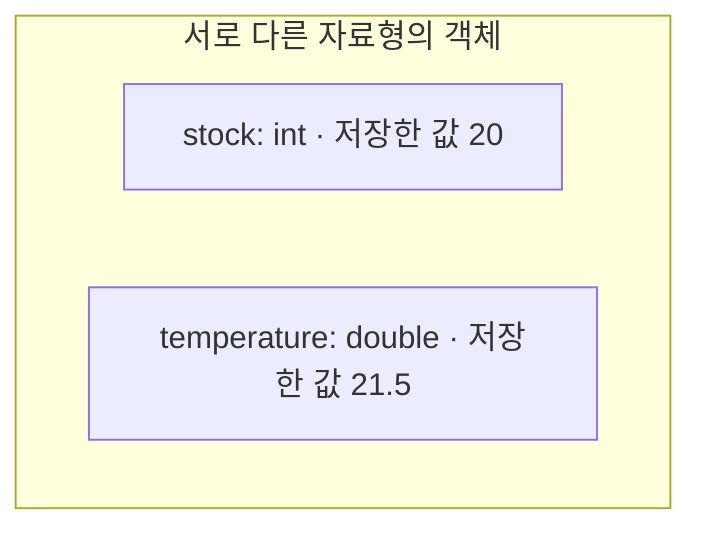

<!--
Chapter: 4 | Part: 2 | Status: Draft 1 (manager review pending)
Goal: 값의 성격과 범위에 맞는 기본 자료형을 선택하고, 초기화·크기·표현 한계를 확인한다.
Prereq secs: Ch3 §3.5 선언/초기화/대입, §3.6 산술식, §3.7 printf; Ch2 C17 빌드와 진단.
Primary source [T]: 천인국, 쉽게 풀어쓴 C언어 Express 개정4판, Ch04.
  c언어 압축 (1).pdf, 책 pp.124-162 = PDF pp.126-164 (1-based), 전 페이지 렌더링·직접 확인.
  §4.1-4.5 pp.124-155 골격; Lab p.156, MiniProject p.157, 정리·문제 pp.158-162은
  범위 및 독창성 확인용. 고정 크기/형식 지정자/초기화/오버플로 설명은 C17에 맞게 보완.
K&R refs [K]: The C Programming Language, Second Edition, Kernighan/Ritchie.
  실제 파일 C Programming Language - 2nd Edition (OCR).pdf, 238쪽 OCR 재편집본, 표제·판·저자 확인.
  §1.4 PDF p.17; §2.1-2.4 pp.35-39; §2.7 pp.41-44; §4.9 시작 pp.76-77;
  Appendix B §B11 PDF p.234 끝의 제목/p.235 본문. 과거 C_Programming.pdf 288쪽 스캔/인쇄본 쪽수와 구별.
External [E]: WG14 N1570 (C11 공개 초안, C17에서도 유지되는 해당 기본 규칙 확인);
  Microsoft Learn Storage of basic types; GCC Warning Options. URL·조항은 HANDOFF.
Baseline: ISO C17; VS2022/MSVC primary, GCC secondary; no VLA.
Toolchains: .c; MSVC /std:c17 /W4; GCC -std=c17 -Wall -Wextra.
Gap IDs: B4 REQUIRED BOX; C1 REQUIRED BOX; C2 REQUIRED BOX; C3 REQUIRED BOX;
  C5 beginner box (full treatment Ch24); C7 const vs #define/enum; C11 optional bool/stdint note.
VISUALs: 변수 저장 상자(개념도), sizeof의 입력·결과 표, 실제 측정 크기 표; 연습문제 4 저장 도식.
Est. pages: 18-22 (편집 전 추정) | DS-flag: 공통 자료형·메모리 기초; DS 진입 단원 아님.
Toolchain verification (2026-10-01): 완전한 예제 A-G 7개, 원고에서 추출한 소스 SHA-256 동일성 확인.
  GCC 13.3.0 Ubuntu 24.04 x86_64, -std=c17 -Wall -Wextra: 각각 PASS, 경고 0/오류 0, exit 0.
  GitHub-hosted Windows Server 2025, win25-vs2026 image 20260922.246.2;
  Visual Studio Enterprise 2026 18.10.1 (18.10.12210.168), cl.exe 19.51.36257 x64;
  /std:c17 /W4: 각각 PASS, 경고 0/오류 0, exit 0; 경고 억제/CRT 매크로 없이 검증.
  stdout 전부 확인; 입력 예제 없음. Run 36814578505; 정확한 명령·출력·해시는 HANDOFF.
Portability measurements: sizeof(char/short/int/long/long long/float/double/long double)
  MSVC = 1/2/4/4/8/4/8/8, GCC = 1/2/4/8/8/4/8/16; 둘 다 CHAR_BIT=8.
  둘 다 INT_MIN=-2147483648, INT_MAX=2147483647, UINT_MAX=4294967295.
  LONG_MIN/MAX: MSVC -2147483648/2147483647, GCC -9223372036854775808/9223372036854775807.
  VS2022에서 이번 예제를 실행했다고 주장하지 않음; 실제 MSVC 판은 2026.
Originality: 한국어 설명·재고/센서/문자 예제·도식·14문항 독자 작성. 원전 Lab/MiniProject/문제 복제 없음.
Exercise policy: 학생용 문제와 짧은 힌트만 제공; Chapter 4 승인 후 별도 해설. 이번 작업에서 해설 생성 없음.
Path policy: 승인 아키텍처상 Part 2; 이번 작업의 명시적 파일 경로 book/part1을 따른다.
Roles: 기본 / 보강 / 추가; 출처와 역할을 별도로 기록.
-->

# Chapter 4. 변수와 자료형

## 이 장에서 배우는 것

- 선언·초기화·대입을 구별하고, 의미가 드러나는 이름과 `const`를 사용한다.
- 정수형·부동 소수점형·문자형의 용도를 구별하고, 필요한 값의 범위에 맞는 자료형을 선택한다.
- `sizeof`, `size_t`, `%zu`로 크기를 확인하고, 표준의 보장과 실습 환경의 측정값을 구분한다.
- `<limits.h>`와 `<float.h>`로 표현 한계를 확인하며, 초기화 전 사용·오버플로·정밀도 손실을 피한다.
- 문자 상수와 문자열 리터럴을 구별하고, 자료형에 맞는 형식 지정자와 이스케이프 시퀀스를 사용한다.

Chapter 3에서는 `int` 변수에 값을 저장하고 계산했다. 재고 수량, 온도, 상태를 나타내는 문자는 필요한 값의 성격과 범위가 다르다. 이 장에서는 값의 종류와 표현 범위를 기준으로 자료형을 선택한다. 자료형 이름만 보고 크기를 단정하는 대신, 프로그램이 실행될 환경에서 직접 확인하는 방법도 익힌다.

완전한 예제 A–G는 각각 다른 `.c` 파일로 저장하여 따로 빌드한다. 언어 기준과 경고 설정은 Chapter 2의 C17 정책을 따른다. 출력은 환경의 한글 표시 설정과 분리하여 관찰할 수 있도록 영문으로 작성했다.

## 4.1 변수와 상수

<!-- SOURCE: [T] §4.1 pp.124-127, 기호 상수 pp.135-137;
[K] §1.4 PDF p.17, §2.1/2.3/2.4 pp.35-39;
[E] N1570 §6.4.2, §6.6p6, §6.7.3, §6.3.2.1, §6.7.9.
ROLE: 기본 + 보강. 식별자/기호 상수를 이 절에 모으고 이후 연산의 규칙은 Ch5에 남김. -->

### 이름을 붙인 저장 공간

변수는 값을 저장하는 공간에 이름을 붙여 사용하는 수단이다. C에서는 값을 저장할 수 있는 메모리 영역을 **객체**라고 한다. 이 장의 변수는 이름으로 접근하는 객체이며, 선언한 자료형에 맞는 값을 저장한다.

```c
int stock = 18;
```

`stock`은 이름이고 `int`는 자료형이다. `18`은 처음 저장할 값이다. 이름은 프로그램에서 이 객체를 찾는 데 쓰이고, 자료형은 표현할 수 있는 값과 그 값을 다루는 방식을 정한다.

선언할 때 처음 값을 정하는 것이 **초기화**다. 이미 선언한 변수에 값을 저장하는 것은 **대입**이다.

```c
int stock = 18;      // 선언과 초기화
stock = 15;         // 새 값 대입
stock = stock + 2;  // 현재 값을 읽어 계산한 뒤 대입
```

마지막 문장은 오른쪽에서 현재 값 `15`를 읽어 `2`를 더하고, 결과를 왼쪽의 `stock`에 저장한다. 대입 전후에 객체의 이름과 자료형은 같고, 저장된 값이 달라진다.

### 식별자와 읽기 쉬운 이름

변수나 함수 등에 붙이는 이름을 **식별자**라고 한다. 이 책의 예제에서는 영문자, 숫자, 밑줄 `_`을 사용한다. 첫 글자는 숫자가 될 수 없고, 대문자와 소문자는 구별한다. `int`, `return`처럼 언어가 정한 키워드를 이름으로 사용할 수 없다.

| 이름 | 판단 | 이유 |
|---|---|---|
| `sensor_count` | 사용 가능 | 단어를 밑줄로 연결했다. |
| `reading2` | 사용 가능 | 첫 글자가 영문자다. |
| `2reading` | 사용 불가 | 숫자로 시작한다. |
| `sensor-count` | 하나의 이름으로 사용 불가 | `-`는 식별자의 구성 문자가 아니다. |
| `double` | 사용 불가 | 자료형을 나타내는 키워드다. |

`stock`과 `Stock`은 서로 다른 이름이다. 문법상 가능한 이름이라도 비슷한 철자를 섞으면 읽기 어렵다. `x`보다 `stock`, `t`보다 `temperature`처럼 의미가 드러나는 이름을 택하자. 초보자 코드에서는 밑줄로 시작하는 이름을 피하는 관례도 권한다. 표준 라이브러리와 구현이 사용하는 이름과 충돌할 가능성을 줄일 수 있다.

### 리터럴과 const

`18`, `21.5`, `'R'`처럼 소스에 값을 직접 적은 표현을 리터럴이라고 부른다. 정수 상수, 부동 소수점 상수, 문자 상수도 각자 자료형을 가진다. 자세한 표기법은 해당 자료형을 배우면서 확인한다.

같은 의미의 값을 여러 곳에서 사용할 때는 이름을 붙이면 좋다. 예를 들어 물품 한 개의 기준 질량이 정해져 있다면 다음처럼 표현할 수 있다.

```c
const double unit_mass = 0.125;
```

`const`는 그 이름을 통해 객체의 값을 수정할 수 없도록 한다. 좀 더 정확히는 `const`로 한정된 객체를 가리키는 식을 수정 가능한 대상으로 사용할 수 없다. 이 장에서는 **값을 바꾸지 않기로 한 이름 있는 값을 표현하는 용도**로 사용한다.

다음은 컴파일 진단을 받는 잘못된 대입이며, 실행할 예제가 아니다.

```c
const double unit_mass = 0.125;
unit_mass = 0.150;   // 잘못: const 객체에 대입할 수 없다.
```

`const`가 붙어도 `unit_mass`는 자료형을 가진 객체다. 컴파일러가 이름을 언제나 숫자로 치환한다는 뜻은 아니다.

**예제 A — 물품 수량과 총질량 기록 (`rack_stock.c`)**

```c
#include <stdio.h>

int main(void)
{
    int stock = 18;
    const double unit_mass = 0.125;

    stock = stock + 2;
    double total_mass = stock * unit_mass;
    printf("Stock: %d\n", stock);
    printf("Mass: %.3f kg\n", total_mass);
    return 0;
}
```

실행 결과:

```text
Stock: 20
Mass: 2.500 kg
```

수량은 정수로, 질량은 소수 부분이 있는 값으로 표현했다. `%.3f`는 `%f`에 출력 정밀도를 더한 형태로 소수점 아래 세 자리까지 표시한다. C17에서는 앞 문장을 실행한 다음 새 변수를 선언할 수 있다. `total_mass`의 초기값은 그 시점의 `stock`과 `unit_mass`로 계산된다.

### const와 컴파일 시 상수는 구별한다

> **보강 — 이름이 있어도 상수의 성격은 다르다**
>
> C17에서 `const int limit = 24;`로 선언한 지역 객체의 이름은 일반적으로 **정수 상수식**이 아니다. 정수 상수식은 컴파일 중 정수 값을 결정해야 하는 곳에서 요구되는 특별한 식이다. 값 변경을 금지하는 것과 이런 식의 조건을 만족하는 것은 별개다.
>
> 단순한 정수 값에 이름을 붙이는 다음 두 방법도 있다.
>
> ```c
> #define PACK_SIZE 24
> ```
>
> `#define`은 전처리 지시문이다. 이 경우 전처리기가 코드의 `PACK_SIZE`를 `24`로 치환한다. 변수 선언이 아니며 끝에 세미콜론을 붙이지 않는다.
>
> ```c
> enum { PACK_SIZE = 24 };
> ```
>
> 이 선언은 `PACK_SIZE`라는 열거 상수를 만든다. 여기서는 이름 있는 `int` 상수로 이해하면 충분하다. 열거 상수는 정수 상수식에 사용할 수 있다. 두 방법을 동시에 써서 같은 이름을 정의하지는 않는다. 열거형의 나머지 기능은 Chapter 15, 전처리기의 상세 기능은 Chapter 20에서 배운다.

### 사용하기 전에 값을 정한다

<!-- SOURCE: [T] Lab p.156, Q&A p.158; [K] §2.4 PDF p.39, §4.9 pp.76-77;
[E] N1570 §6.7.9p10, §6.3.2.1p2, §6.2.6.1.
ROLE: 보강; GAP B4 REQUIRED BOX. 원전의 초기값 Lab을 안전한 오류 분석으로 전환. -->

> **필수 — 초기화되지 않은 지역 변수**
>
> `main` 안에 단순히 `int count;`라고 선언한 지역 자동 변수는, 값을 저장하기 전까지 값이 **불확정(indeterminate)** 상태다. 이를 “아무 숫자나 하나 들어 있으니 읽어도 된다”라고 이해하면 안 된다. 초기화 전 읽기는 경우와 자료형에 따라 정의되지 않은 동작으로 이어질 수 있다. 다음의 `count`를 출력하는 코드는 그에 해당한다. **실행하여 숫자를 관찰할 실습이 아니다.**
>
> ```c
> int count;
> printf("%d\n", count);  // 잘못: 저장한 적 없는 값을 읽는다.
> ```
>
> 이 장의 규칙은 간단하다. **값을 읽기 전에 초기화하거나 대입한다.** 누적 수량을 세려면 `int count = 0;`처럼 목적에 맞는 초기값을 정한다. 입력으로 값을 정한다면 Chapter 3처럼 입력 성공을 확인한 뒤 사용한다.
>
> 정적 저장 기간을 갖는 변수는 초기화 규칙이 다르다. 그 규칙과 `static`은 Chapter 9에서 다룬다.

다음처럼 뒤에서 값을 저장할 계획이 분명한 선언도 가능하다. 아래에서는 `count`를 읽기 전에 대입하므로 초기값 없이 읽는 문제가 없다.

```c
int count;
count = 6;
printf("%d\n", count);
```

## 4.2 자료형과 크기

<!-- SOURCE: [T] §4.2 pp.127-129; [K] §2.2 PDF pp.35-36;
[E] N1570 §6.2.5, §6.5.3.4p2/4/5, §7.19, §7.21.6.1.
ROLE: 기본 + 보강; GAP C1 REQUIRED BOX. -->

### 자료형이 정하는 것

자료형은 저장할 값의 종류, 표현할 수 있는 범위, 객체에 필요한 크기, 연산에서 값을 해석하는 방식을 정한다. `int stock`과 `double temperature`는 이름만 다른 상자가 아니다. 정수와 부동 소수점 값은 표현 방식이 다르다.

| 분류 | 먼저 익힐 자료형 | 용도 |
|---|---|---|
| 정수형 | `short`, `int`, `long`, `long long`과 부호 없는 형태 | 개수, 정수 단위의 양 |
| 부동 소수점형 | `float`, `double` | 온도, 측정량처럼 소수 부분이 있는 값 |
| 문자형 | `char` | 기본 문자의 코드 값을 저장 |

문자형도 C의 분류에서는 정수형에 속한다. 다만 문자로 사용하는 관점에서 별도로 배운다.

다음은 두 변수를 읽기 위한 **개념적 저장 도식**이다. 테두리는 객체를 나타내며, 실제 바이트 배치나 주소, 상대적인 크기를 나타내지 않는다.



`stock`에는 수량을, `temperature`에는 온도를 저장했다. 두 객체의 크기는 그림의 상자 폭으로 판단하지 않고 `sizeof`로 확인한다.

### sizeof는 크기를 구하는 연산자다

`sizeof`는 자료형이나 객체의 크기를 **바이트 단위**로 알려 주는 연산자다. 함수가 아니다. 자료형 이름을 사용할 때는 괄호로 감싼다. 객체 이름에도 적용할 수 있으며, 이 책에서는 읽기 쉽게 괄호를 사용한다.

| 식 | 확인하는 것 |
|---|---|
| `sizeof(int)` | `int` 객체 하나의 크기 |
| `sizeof(double)` | `double` 객체 하나의 크기 |
| `sizeof(temperature)` | 선언된 `temperature` 객체의 자료형에 따른 크기 |

크기는 저장된 값의 숫자 자릿수를 세는 결과가 아니다. `int` 객체에 `1` 대신 `1000`을 저장해도 그 객체의 크기는 같고, `sizeof`가 알려 주는 바이트 수도 같다.

> **필수 — sizeof의 결과는 size_t**
>
> `sizeof`의 결과는 `size_t`형이다. `size_t`는 객체의 크기를 표현하는 데 사용하는 부호 없는 정수형이며, `<stddef.h>`에 선언되어 있다. `<stdio.h>` 등에도 선언되지만, 다음 예제는 사용하는 자료형을 분명히 드러내기 위해 `<stddef.h>`를 직접 포함한다.
>
> 결과를 담을 변수도 `size_t`로 선언하고, 출력에는 `%zu`를 쓴다. `%d`는 `int`용이므로 `sizeof`의 결과를 출력하는 일반적인 방법으로 사용할 수 없다.

**예제 B — 자료형 크기 측정 (`type_sizes.c`)**

```c
#include <stdio.h>
#include <stddef.h>
#include <limits.h>

int main(void)
{
    double temperature = 21.5;
    size_t bytes = sizeof(temperature);
    printf("char: %zu\n", sizeof(char));
    printf("short: %zu\n", sizeof(short));
    printf("int: %zu\n", sizeof(int));
    printf("long: %zu\n", sizeof(long));
    printf("long long: %zu\n", sizeof(long long));
    printf("float: %zu\n", sizeof(float));
    printf("double: %zu\n", sizeof(double));
    printf("long double: %zu\n", sizeof(long double));
    printf("temperature: %zu\n", bytes);
    printf("CHAR_BIT: %d\n", CHAR_BIT);
    return 0;
}
```

`sizeof(temperature)`는 온도 값이 아닌 `double`형 객체의 크기를 구한다. 이 장처럼 일반적인 기본 자료형에 `sizeof`를 적용할 때는 객체에 저장된 값을 읽어 계산하는 것도 아니다.

C는 `sizeof(char) == 1`을 보장한다. 이때 1바이트는 `char` 객체 하나의 크기를 기준으로 하는 단위다. **C의 바이트가 모든 구현에서 정확히 8비트라는 뜻은 아니다.** `<limits.h>`의 `CHAR_BIT`가 한 바이트의 비트 수를 알려 주며, 표준은 최소 8비트를 요구한다. 이 책에서 검증한 실습 환경의 값은 8이었다.

다음 표는 **이 책의 현재 실습 환경에서 예제 B로 측정한 바이트 수**다. MSVC는 Windows x64에서, GCC는 Linux x86_64에서 실행했다. C 표준이 모든 환경에 지정한 크기 표가 아니다.

| 자료형 | Windows / MSVC | Linux / GCC |
|---|---:|---:|
| `char` | 1 | 1 |
| `short` | 2 | 2 |
| `int` | 4 | 4 |
| `long` | 4 | 8 |
| `long long` | 8 | 8 |
| `float` | 4 | 4 |
| `double` | 8 | 8 |
| `long double` | 8 | 16 |

두 환경 모두 `CHAR_BIT`는 8이었다. 같은 소스를 두 곳에서 빌드했지만 `long`과 `long double`의 크기는 달랐다. 이것이 자료형 이름만 보고 바이트 수를 고정하면 안 되는 이유다. 자신의 실습 결과가 표와 다르다면 먼저 컴파일러와 대상 환경을 확인하자.

### 같은 이름이라도 크기는 확인한다

정수형은 표준이 정한 최소 범위와 관계를 만족해야 하지만, 모든 구현에서 동일한 바이트 수를 갖도록 정해진 것은 아니다. `short`보다 `int`, `int`보다 `long`의 표현 범위가 좁아지지 않는 관계는 보장된다. 그 사이의 크기나 범위가 같을 수도 있다. 따라서 `long`이라는 이름만 보고 “`int`보다 반드시 바이트 수가 많다”라고 판단하면 안 된다.

부동 소수점형도 `float`가 표현할 수 있는 값은 `double`에서도 표현할 수 있고, `double`의 값은 `long double`에서도 표현할 수 있다. 그러나 각 자료형의 정확한 크기와 정밀도는 구현의 특성이다. 뒤에서 `<limits.h>`와 `<float.h>`로 필요한 정보를 확인한다.

## 4.3 정수형

<!-- SOURCE: [T] §4.3 pp.129-142; [K] §2.2/2.3 PDF pp.35-39, §B11 p.235;
[E] N1570 §5.2.4.2.1, §6.2.5p4-9, §6.4.4.1, §7.21.6.1.
ROLE: 기본 + 보강. 내부 비트 표현/2의 보수/비트 연산은 Ch23에 남김. -->

### 정수형의 여러 형태

`int`는 먼저 고려할 일반적인 정수형이다. 더 큰 범위가 필요하면 `long`이나 `long long`의 한계를 확인한다. 작은 범위에 적합한 `short`도 있다. 여기서 “작다”, “크다”는 이름만으로 판단하지 않고 구현의 범위와 크기로 확인한다.

| 부호 있는 형태 | 줄이지 않은 이름 | 대응하는 부호 없는 형태 |
|---|---|---|
| `short` | `short int` | `unsigned short` |
| `int` | `signed int` | `unsigned int` |
| `long` | `long int` | `unsigned long` |
| `long long` | `long long int` | `unsigned long long` |

표의 부호 있는 형태에는 `signed`를 붙여 써도 된다. `unsigned`만 쓰면 `unsigned int`를 뜻한다. 반면 `char`의 부호 여부는 별도의 규칙이므로 §4.5에서 구별한다.

부호 있는 정수형은 음수, 0, 양수를 표현한다. 부호 없는 정수형은 0 이상의 정수를 표현한다. 대응하는 부호 있는 형과 부호 없는 형은 같은 크기를 사용하지만, 표현 범위는 다르다. 그렇다고 음수가 필요 없다는 이유만으로 모든 변수에 `unsigned`를 붙이는 것은 좋은 기준이 아니다. 뺄셈이나 다른 자료형과의 비교까지 고려해야 한다.

### 정수 상수의 표기와 출력 형식

작은 10진 정수 상수 `24`는 `int`형이다. `24U`, `24L`, `24LL`처럼 접미사를 붙이면 각각 이 값에 대해 `unsigned int`, `long`, `long long`형을 지정한다. 더 큰 값의 정확한 자료형은 값, 진법, 접미사에 따라 결정된다. 이 장에서는 필요한 범위에 맞는 작은 값과 접미사를 사용한다.

10진 정수에 자릿수 구분용 쉼표를 넣지 않는다. `1,000` 대신 `1000`이라고 쓴다. 또 `024`처럼 앞에 0을 붙이면 8진 정수 상수로 해석되므로, 10진 수량을 적을 때는 불필요한 앞자리 0을 붙이지 않는다. `0x`로 시작하는 16진 표기는 저수준 표현을 배우는 장에서 다시 다룬다.

**예제 C — 정수 값과 형식 지정자 (`integer_records.c`)**

```c
#include <stdio.h>

int main(void)
{
    int adjustment = -3;
    unsigned int sealed_boxes = 24U;
    long recorded_bytes = 1200000L;
    long long archive_bytes = 5000000000LL;

    printf("Adjustment: %d\n", adjustment);
    printf("Boxes: %u\n", sealed_boxes);
    printf("Recorded: %ld bytes\n", recorded_bytes);
    printf("Archive: %lld bytes\n", archive_bytes);
    return 0;
}
```

실행 결과:

```text
Adjustment: -3
Boxes: 24
Recorded: 1200000 bytes
Archive: 5000000000 bytes
```

`%d`는 `int`, `%u`는 `unsigned int`, `%ld`는 `long`, `%lld`는 `long long`에 맞는 형식이다. 부호 없는 `long`과 `long long`에는 각각 `%lu`, `%llu`를 사용한다. 변수에 작은 숫자를 넣었다고 해서 자료형과 다른 형식 지정자를 써도 되는 것은 아니다.

### 범위는 limits.h에서 확인한다

C17은 `short`와 `int`가 적어도 −32767부터 32767까지, `long`이 적어도 −2147483647부터 2147483647까지 표현하도록 요구한다. 이는 최소 보장이다. 예를 들어 실습 환경의 `int` 범위가 더 넓더라도, 그 수치를 모든 C 구현의 규칙으로 일반화할 수 없다.

실제 한계는 `<limits.h>`의 매크로로 확인한다. 매크로의 이름은 같아도 값은 구현에 따라 달라질 수 있다.

| 이름 | 의미 | 출력 형식 |
|---|---|---|
| `INT_MIN`, `INT_MAX` | `int`의 최솟값·최댓값 | `%d` |
| `UINT_MAX` | `unsigned int`의 최댓값 | `%u` |
| `LONG_MIN`, `LONG_MAX` | `long`의 최솟값·최댓값 | `%ld` |
| `LLONG_MIN`, `LLONG_MAX` | `long long`의 최솟값·최댓값 | `%lld` |

**예제 D — 현재 구현의 정수 한계 (`integer_limits.c`)**

```c
#include <stdio.h>
#include <limits.h>

int main(void)
{
    printf("INT_MIN: %d\n", INT_MIN);
    printf("INT_MAX: %d\n", INT_MAX);
    printf("UINT_MAX: %u\n", UINT_MAX);
    printf("LONG_MIN: %ld\n", LONG_MIN);
    printf("LONG_MAX: %ld\n", LONG_MAX);
    printf("LLONG_MAX: %lld\n", LLONG_MAX);
    return 0;
}
```

이 출력은 실행한 구현의 한계다. 다른 환경으로 옮겨 빌드하면 다시 확인해야 한다. 필요로 하는 값의 범위가 자료형의 한계 안에 들어가는지를 기준으로 선택하자. 저장할 최종 값뿐 아니라 중간 계산 결과도 범위를 벗어나면 안 된다.

> **보강 — long의 범위도 달랐다**
>
> 앞의 두 실습 환경에서 `int`는 모두 −2147483648부터 2147483647까지였다. 그러나 `long`은 Windows/MSVC에서 같은 범위였고, Linux/GCC에서는 −9223372036854775808부터 9223372036854775807까지였다.
>
> `long`을 사용했다고 큰 수가 언제나 들어가는 것은 아니다. 예제 C의 5000000000은 이 두 환경에서 모두 표현할 수 있는 `long long`에 저장했다. 크기와 한계는 실제 대상 환경에서 함께 확인한다.

### 정수 오버플로와 부호 없는 연산

<!-- SOURCE: [T] 오버플로 pp.132-133; [K] §2.7 PDF pp.41-44;
[E] N1570 §6.5p5, §6.2.5p9, §6.3.1.3/1.8.
ROLE: 보강; GAP C2/C3 REQUIRED BOX. 안전한 unsigned int 실험만 실행. -->

> **필수 — 부호 있는 정수의 한계를 넘기면**
>
> 다음은 위험을 설명하는 코드 조각이다. **실행하거나 출력 결과를 예측하지 않는다.**
>
> ```c
> int count = INT_MAX;
> count = count + 1;  // 잘못: int로 표현할 수 없는 계산 결과
> ```
>
> 부호 있는 정수 계산의 결과가 그 자료형의 범위를 벗어나면 C에서 **정의되지 않은 동작**이다. 가장 작은 음수로 항상 되돌아간다는 규칙은 없다. 경고가 없거나 한 번의 실행에서 어떤 숫자가 나왔더라도 그 결과에 의존할 수 없다.
>
> 더 큰 자료형을 고려하되, 그 자료형도 한계가 있다. 실제 프로그램에서는 값과 계산 범위가 충분히 작다는 근거를 확인하거나 계산 전에 범위를 검사해야 한다. 검사식을 만드는 방법은 이후 조건문·연산 학습과 함께 다룬다.

부호 없는 정수형의 연산 결과에는 별도의 규칙이 있다. 결과 자료형의 최댓값보다 1 큰 수를 주기로 값이 순환한다. 값 비트가 N개라면 주기는 2의 N승이다. `unsigned int`끼리의 덧셈은 이 규칙에 따라 처리된다.

**예제 E — 부호 없는 정수의 순환 확인 (`unsigned_cycle.c`)**

```c
#include <stdio.h>
#include <limits.h>

int main(void)
{
    unsigned int serial = UINT_MAX;

    printf("Before: %u\n", serial);
    serial = serial + 1U;
    printf("After: %u\n", serial);
    return 0;
}
```

`Before`에는 현재 구현의 `UINT_MAX`가, `After`에는 `0`이 출력된다. 여기서는 두 피연산자가 `unsigned int`이므로 부호 없는 연산의 규칙을 안전하게 관찰할 수 있다. 다만 물품 수량이 최대치를 넘자 0이 되는 동작은 대부분의 업무에서 잘못된 결과다. **값이 순환하도록 정의되어 있다는 사실이 업무상 오류를 막아 주지는 않는다.** `unsigned`는 모든 오버플로 위험을 해결하는 방법이 아니다.

> **필수 — signed와 unsigned를 섞기 전에**
>
> `int a = -1;`과 `unsigned int b = 1U;`를 비교할 때 `a < b`를 수학의 −1과 1만으로 판단하면 안 된다. 서로 다른 정수형을 함께 사용하면 계산이나 비교 전에 변환이 일어날 수 있기 때문이다. 이 조합에서는 비교 결과가 거짓이 된다.
>
> 여기서는 불필요한 부호 혼합을 피하고, 비교할 값의 자료형을 먼저 확인하는 습관을 익힌다. 변환 순서와 규칙은 Chapter 5에서 배운다. 단순히 경고를 없애려고 `unsigned`로 바꾸거나 형변환을 덧붙이지 말자.

### 환경 차이와 잘못된 코드의 차이

<!-- SOURCE: [E] N1570 §3.4.1/3, §6.2.5p9, §6.5p5, §6.3.2.1p2;
[K] §2.2 PDF pp.35-36; ROLE: 추가; GAP C5 도입, 전체 분류는 Ch24. -->

> **보강 — C의 동작을 읽는 세 가지 표현**
>
> | 표현 | 이 장에서의 의미 | 예 |
> |---|---|---|
> | 정의된 동작 | 표준의 규칙에 따라 결과를 설명할 수 있다. | `unsigned int`의 최댓값에 `1U`를 더하면 0이 된다. |
> | 구현에 따라 정해지는 특성·동작 | 표준이 허용한 선택을 구현이 정하고 문서화한다. | 정확한 기본 자료형 크기, 일반 `char`의 부호 여부 |
> | 정의되지 않은 동작 | 표준이 프로그램의 결과에 요구 사항을 두지 않는다. | 부호 있는 정수 오버플로, 앞서 본 초기화 전 `count` 읽기 |
>
> 두 번째를 *구현 정의(implementation-defined)*라고 부른다. 구현마다 `long`의 크기가 다를 수 있는 것과, 잘못된 계산의 결과를 정해 놓지 않은 것은 서로 다른 문제다. 정의되지 않은 동작이 반드시 즉시 충돌이나 오류 메시지로 드러나는 것도 아니다. 자세한 분류는 Chapter 24에서 정리한다.

## 4.4 부동 소수점형

<!-- SOURCE: [T] §4.4 pp.142-149; [K] §2.2/2.3 PDF pp.35-39, §B11 p.235;
[E] N1570 §5.2.4.2.2, §6.2.5p10, §6.4.4.2p4, §6.5.2.2p6, §7.21.6.1.
ROLE: 기본 + 보강. 비트 배치/IEEE 세부/오차 분석의 심화는 제외. -->

### 범위와 정밀도는 서로 다르다

온도나 질량처럼 소수 부분을 사용하려면 `float` 또는 `double`을 고려한다. 부동 소수점형은 유한한 저장 공간으로 수를 근사하여 표현한다. 아주 큰 수나 작은 수를 표현할 수 있어도, 모든 자릿수를 정확히 보존한다는 뜻은 아니다.

**범위**는 얼마나 큰 값이나 작은 값을 표현할 수 있는가에 관한 특성이다. **정밀도**는 값을 얼마나 세밀하게 구별하고 유효한 자릿수를 보존할 수 있는가에 관한 특성이다. 같은 자료형에서도 값의 크기에 따라 서로 이웃한 표현 가능 값 사이의 간격이 달라질 수 있다.

일반적인 계산에는 `double`을 우선 고려한다. `float`보다 정밀도가 낮지는 않으며, 이 책의 실습 환경에서는 더 많은 유효 자릿수를 제공했다. `long double`도 있지만 `double`보다 항상 크거나 더 정밀하다고 보장되지는 않는다. 각 형의 바이트 수는 예제 B로, 정밀도와 범위는 `<float.h>`로 확인한다.

| 매크로 | 확인하는 특성 |
|---|---|
| `FLT_DIG`, `DBL_DIG` | 10진 값을 각각 `float`, `double`로 바꾼 뒤 다시 10진수로 표현할 때 보존할 수 있는 유효 자릿수의 기준 |
| `FLT_MAX`, `DBL_MAX` | 각각 표현 가능한 가장 큰 유한한 양수 |

`FLT_DIG`가 6이라면 “소수점 아래가 언제나 여섯 자리까지 정확하다”라는 뜻이 아니다. 유효 자릿수는 소수점 앞뒤를 합하여 값의 의미를 담는 자릿수를 센다. 그 기준보다 적은 자릿수만 쓰더라도 모든 10진 소수가 정확한 내부 값으로 저장되는 것은 아니다.

### 부동 소수점 상수와 출력

`21.375`처럼 접미사 없는 부동 소수점 상수는 `double`형이다. `21.375f`처럼 `f`를 붙이면 `float`형이다. `1.25e3`은 1.25에 10의 3승을 곱한 값, 곧 1250.0을 나타내는 `double` 상수다.

출력의 `%f`는 소수점 표기를, `%e`는 지수 표기를 사용한다. `%.2f`는 소수점 아래 두 자리로 표시한다. **출력 자릿수를 줄이는 것과 저장된 값을 바꾸는 것은 별개**다. 화면에 `0.30`이라고 보여도 내부 값이 수학적 0.3과 정확히 같다는 증거는 아니다.

`printf`에 전달한 `float` 값은 `double`로 변환되어 전달되므로 `%f`나 `%e`로 출력하는 것이 맞다. 이 규칙은 `printf`의 인수 전달에 관한 규칙이다. `scanf`의 입력 형식에 그대로 적용하면 안 된다. 인수 변환의 상세 규칙은 뒤에서 배운다.

### 10진 소수는 근삿값으로 저장될 수 있다

10진수에서 1/3을 유한한 자릿수로 정확히 적을 수 없는 것처럼, 2진 부동 소수점 표현에서는 0.1과 같은 여러 10진 소수를 정확히 나타낼 수 없다. 가까운 표현 가능 값으로 저장되며, 계산과 출력에서도 반올림이 일어날 수 있다. `double`을 사용하면 정밀도가 개선될 수 있지만 이런 특성이 사라지는 것은 아니다.

**예제 F — 센서 값과 정밀도 관찰 (`floating_reading.c`)**

```c
#include <stdio.h>
#include <float.h>

int main(void)
{
    float sensor = 21.375f;
    double first = 0.1;
    double second = 0.2;
    double total = first + second;

    printf("Sensor: %.3f\n", sensor);
    printf("Total (2): %.2f\n", total);
    printf("Total (17): %.17f\n", total);
    printf("Digits: %d %d\n", FLT_DIG, DBL_DIG);
    printf("Maximum: %e %e\n", FLT_MAX, DBL_MAX);
    return 0;
}
```

`%.17f`는 근사 표현을 관찰하려고 소수점 아래 17자리까지 출력하는 도구로 사용했다. 출력 자릿수를 늘려도 원래 계산의 정확도가 높아지지는 않는다.

이번 MSVC/GCC 검증에서 모두 다음 결과를 얻었다.

```text
Sensor: 21.375
Total (2): 0.30
Total (17): 0.30000000000000004
Digits: 6 15
Maximum: 3.402823e+38 1.797693e+308
```

이는 해당 실습 환경의 관찰 결과이며, 모든 C 구현이 마지막 자리까지 같은 문자열을 출력한다는 보장은 아니다. 부동 소수점 표현과 계산·출력 방식의 세부 특성에 따라 달라질 수 있다.

이 실습에서 볼 점은 수학적 기대와 마지막 자릿수가 조금 다를 수 있다는 것이다. 그 차이가 작아도, 누적 계산이나 가까운 두 값의 판단에서 문제가 될 수 있다. 필요한 정확도에 맞는 자료형과 계산 방법을 선택해야 한다. 오차를 고려한 비교 방법은 이후 장에서 다룬다.

## 4.5 문자형

<!-- SOURCE: [T] §4.5 pp.149-155; [K] §2.3 PDF pp.37-38, §2.7 p.42;
[E] N1570 §6.2.5p3/15, §6.4.4.4/6.4.5, §5.2.2, §7.21.6.1.
ROLE: 기본 + 보강. 문자 인코딩 구조/문자열 저장은 Ch14 이후로 유보. -->

### 문자와 문자 코드는 연결되어 있다

문자는 컴퓨터에서 코드 값으로 표현된다. `char`는 기본 실행 문자 집합의 문자 하나를 저장할 수 있는 정수형이다. 다음은 문자 상수를 사용하여 `char` 객체를 초기화한다.

```c
char label = 'R';
```

`'R'`은 작은따옴표로 적은 문자 상수다. C에서 이런 일반적인 문자 상수 자체의 자료형은 `int`이며, 여기서는 그 코드 값을 `char` 객체에 저장한다. 출력할 때 `%c`를 쓰면 문자로 표시한다. 코드 값을 숫자로 확인할 수도 있지만, 문자를 적는 데 숫자 코드 자체를 외울 필요는 없다.

ASCII는 널리 사용되는 문자 인코딩의 기본 부분이다. ASCII에서 `'A'`는 65, `'0'`은 48이다. 그러나 **C 언어가 모든 구현의 실행 문자 코드를 ASCII로 지정하는 것은 아니다.** 실습 환경의 코드 값과 언어의 보장은 구별한다. 이 장에서는 `'R'`, `'0'`처럼 기본 문자만 사용한다. 한글 등 여러 바이트가 필요한 문자와 문자열은 Chapter 14에서 다룬다.

> **보강 — 일반 char의 부호는 고정되어 있지 않다**
>
> `char`가 부호 있는 쪽과 부호 없는 쪽 중 어느 범위를 사용하는지는 구현이 정한다. `signed char`, `unsigned char`를 명시하는 방법도 있지만, 둘은 일반 `char`와 구별되는 자료형이다. 이 장처럼 기본 문자를 저장할 때는 `char`를 사용한다. 작은 정수 계산을 하려고 `char`의 범위를 임의로 −128부터 127까지라고 가정하지 말자.

### 'R'과 "R"은 다르다

| 표기 | 뜻 | 이 장에서의 출력 |
|---|---|---|
| `'R'` | 문자 상수 | `printf("%c\n", 'R');` |
| `"R"` | 문자열 리터럴 | `printf("%s\n", "R");` |

화면에 나타나는 글자가 같아도 두 표현은 같은 종류의 값이 아니다. `char label = "R";`처럼 문자열 리터럴을 문자 하나의 초기값으로 사용하면 안 된다. 문자열을 저장하는 구조는 Chapter 14에서 배운다. 지금은 작은따옴표와 큰따옴표의 역할부터 구별하자.

### 이스케이프 시퀀스

문자 상수나 문자열 리터럴 안에서 역슬래시 `\`로 시작하는 특별한 표기를 **이스케이프 시퀀스**라고 한다. 하나의 이스케이프 시퀀스는 문자를 나타낸다. 화면 줄을 바꾸거나, 따옴표·역슬래시 자체를 표현할 때 사용한다.

| 표기 | 나타내는 문자 | 사용 예 |
|---|---|---|
| `\n` | 줄바꿈 | `"Done\n"` |
| `\t` | 수평 탭 | `"Code\tValue"` |
| `\\` | 역슬래시 | `"a\\b"` |
| `\'` | 작은따옴표 | `'\''` |
| `\"` | 큰따옴표 | `"\"Ready\""` |

`'\n'`은 줄바꿈 문자 상수이며, `"\n"`은 줄바꿈 문자를 담은 문자열 리터럴이다. 표시할 때 같은 줄바꿈을 일으킬 수 있어도 두 표현의 종류는 다르다. 탭이 화면에서 차지하는 폭은 표시 환경에 따라 달라지므로 고정된 개수의 공백이라고 단정하지 않는다.

**예제 G — 상태 문자와 경로 표시 (`character_label.c`)**

```c
#include <stdio.h>

int main(void)
{
    char label = 'R';
    int code = label;
    char quote = '\'';

    printf("Label: %c\n", label);
    printf("Code: %d\n", code);
    printf("Text: %s\n", "R");
    printf("Quote: %c\n", quote);
    printf("Folder: data\\logs\n");
    printf("Message: \"Ready\"\n");
    printf("Column\tValue\n");
    return 0;
}
```

출력에서 `Folder`에는 역슬래시 하나가, `Message`에는 큰따옴표가 표시된다. 소스의 따옴표는 리터럴의 범위를 정하고, 이스케이프한 따옴표는 출력할 문자다. `Code`는 해당 실행 문자 집합의 코드 값이다. 이 책의 검증 환경에서는 ASCII에 해당하는 값 `82`가 출력되었다.

### 선택 읽기: 목적을 드러내는 표준 자료형

<!-- SOURCE: [E] N1570 §6.2.5p2, §7.18, §7.20.1.1;
ROLE: 추가; GAP C11 RECOMMENDED. C17만 설명; _Static_assert는 Ch24에 유보. -->

> C17에는 참·거짓을 저장하는 내장 자료형 `_Bool`이 있다. `<stdbool.h>`는 이를 `bool`로 쓸 수 있게 하는 매크로와 `true`, `false`를 제공한다. 조건 판단을 배우는 과정에서 다시 사용한다.
>
> 정확한 비트 폭이 필요한 작업에는 `<stdint.h>`의 `int32_t`, `uint32_t` 같은 이름을 고려할 수 있다. 해당 정확한 폭의 자료형을 구현이 제공할 때만 이런 이름이 존재한다. 모든 C 구현에 `int32_t`가 있다고 가정하면 안 된다. 기본적인 수량에는 `int`부터 검토하고, 고정 폭 자료형의 실제 활용은 저수준 자료 표현을 배우는 장에 남긴다.

## 자주 하는 실수

| 실수 | 확인하거나 고칠 점 |
|---|---|
| 모든 `int`는 반드시 4바이트라고 외운다. | 표준의 최소 범위와 실제 `sizeof` 결과를 구별한다. |
| `sizeof` 결과를 `%d`로 출력한다. | 결과형은 `size_t`; 출력에는 `%zu`를 사용한다. |
| `int x, y = 0;`이면 둘 다 초기화했다고 생각한다. | 초기값은 `y`에만 있다. 각각 `int x = 0;`, `int y = 0;`으로 쓰면 분명하다. |
| 지역 변수의 초기값을 임의의 숫자로 생각하고 읽는다. | 불확정 값에 의존하지 않고 읽기 전에 값을 저장한다. |
| 부호 있는 정수의 한계를 넘으면 언제나 순환한다고 생각한다. | 부호 있는 정수 오버플로는 정의되지 않은 동작이다. |
| `unsigned`를 쓰면 계산이 자동으로 안전해진다고 생각한다. | 값의 순환도 업무상 오류가 될 수 있고, 부호 혼합도 확인해야 한다. |
| `float`와 `double`이 모든 10진 소수를 정확히 저장한다고 생각한다. | 유한한 표현과 반올림을 고려한다. 출력 자릿수도 저장 정밀도와 다르다. |
| `'R'`과 `"R"`을 서로 바꾸어 쓴다. | 문자 상수와 문자열 리터럴을 구별한다. |
| `const` 객체에 다시 대입하거나 컴파일 시 정수 상수라고 단정한다. | 수정 금지와 정수 상수식의 규칙을 구별한다. |
| 값이 작으니 다른 정수 형식 지정자를 써도 된다고 생각한다. | 숫자 크기가 아닌 인수의 자료형에 형식을 맞춘다. |

## 핵심 정리

- 변수는 이름으로 접근하는 객체다. 선언은 이름과 자료형을 정하고, 초기화는 처음 값을, 대입은 이후 저장할 값을 정한다.
- `const`는 수정할 수 있는 대상을 제한한다. 일반적인 지역 `const` 객체의 이름이 C17의 정수 상수식이 되는 것은 아니다.
- 자료형 크기는 `sizeof`로 측정한다. 결과형 `size_t`에는 `%zu`를 사용한다. `sizeof(char)`는 1이고, 한 바이트의 비트 수는 `CHAR_BIT`로 확인한다.
- 자료형의 실제 범위는 `<limits.h>`로 확인한다. 부호 있는 정수 오버플로의 결과를 예측해서는 안 되며, 부호 없는 값의 순환도 의도에 맞는지 판단해야 한다.
- 지역 자동 변수는 값을 저장한 다음 읽는다. 불확정 값을 출력하여 의미 있는 초기값을 알아내는 실습은 하지 않는다.
- 부동 소수점형의 범위와 정밀도는 다르다. `<float.h>`로 특성을 확인하고, 10진 소수가 근사 표현될 수 있음을 고려한다.
- `char`는 문자 코드 값을 저장한다. 문자 상수와 문자열 리터럴을 구별하고, 줄바꿈·탭·따옴표·역슬래시에는 적절한 이스케이프 표기를 사용한다.

## 연습문제

<!-- SOURCE: [T] pp.159-162 범위 확인; [K] §2.1-2.4 개념 범위;
ROLE: 추가. 14문항 전부 신규; 안전한 출력 예측/오류 수정/작성/도식 포함. -->

문제에 제시한 코드 조각은 따로 표시하지 않은 한 `main` 안의 내용이며, 필요한 표준 헤더가 포함되어 있다고 가정한다. **오류 분석용 코드는 실행하지 않는다.** 답은 판단의 근거와 함께 적는다. 완전한 프로그램을 작성하는 문제는 `int main(void)`와 적절한 반환문을 포함하고 C17 경고 설정으로 확인한다. 힌트는 출발점만 제공하며 전체 해설은 별도 문서에서 다룬다.

### 1. 선언·초기화·대입과 출력 예측

다음에서 선언과 초기화가 함께 이루어지는 곳, 이후 대입이 이루어지는 곳을 구별하고 출력 두 줄을 예측하라.

```c
int stored = 9;
int added = 4;
stored = stored + added;
added = 2;
printf("%d %d\n", stored, added);
printf("%d\n", stored + added);
```

*힌트: 각 문장을 실행한 뒤 두 변수에 저장된 값을 표로 적는다.*

### 2. 이름 검토

`room_total`, `4th_room`, `return`, `room total`, `RoomTotal`, `room_total2` 중 식별자로 사용할 수 있는 것을 고르고 나머지 이유를 설명하라. “상자 수”와 “상자 한 개의 질량”을 저장할 이름도 직접 제안하라.

*힌트: 문법에 맞는 이름과 의미가 잘 드러나는 이름을 나누어 생각한다.*

### 3. const의 의미

`const int sample_limit = 16;`에 관한 다음 주장 중 수정할 것을 찾고 이유를 설명하라.

1. `sample_limit`은 자료형이 있는 객체다.
2. 이후 `sample_limit = 20;`이라고 대입해도 된다.
3. C17은 `sample_limit`을 모든 곳에서 사용할 수 있는 정수 상수식으로 보장한다.
4. `#define`으로 이름을 치환하는 것과 `const` 선언은 같은 장치다.

단순한 정수 상수에 이름을 붙이는 `#define` 또는 `enum` 예를 하나 작성하라.

*힌트: 수정 금지, 객체, 전처리 치환을 구별한다.*

### 4. 변수 저장 도식과 크기

`int pieces = 7;`과 `double mass = 1.75;`를 두 개의 개념적 저장 상자로 그려 이름·자료형·값을 표시하라. `pieces = 12;` 이후 무엇이 바뀌는지 표시하고, 각 객체의 실제 바이트 수를 확인할 식을 쓰라. 그림의 상자 폭이 실제 크기를 뜻하지 않는 이유도 적는다.

*힌트: 저장 값과 자료형에 따른 크기는 서로 다른 정보다.*

### 5. sizeof 코드 고치기

다음은 오류 분석용 코드다. `sizeof`의 결과를 원래 결과형으로 저장하고 올바르게 출력하도록 두 줄을 고쳐라. 직접 선언한 자료형을 제공하는 헤더도 적는다.

```c
int bytes = sizeof(long);
printf("%d\n", sizeof(long));
```

*힌트: 결과가 작은 환경에서도 통용되는 자료형·형식을 사용한다.*

### 6. 측정값과 표준의 보장

예제 B를 자신의 환경에서 빌드하여 여덟 자료형의 크기와 `CHAR_BIT`를 기록하라. 아래 중 C의 보장인지, 해당 환경의 측정 결과인지 구별하고, 맞지 않는 주장은 고쳐라.

1. `sizeof(char)`의 결과가 1이다.
2. 이 실습에서 `CHAR_BIT`가 8이었다.
3. 이 실습에서 `sizeof(long)`의 결과가 4 또는 8이었다.
4. 같은 이름의 자료형이면 모든 환경에서 바이트 수가 같다.

*힌트: 다른 환경에서 빌드해도 반드시 같아야 하는 주장인지 확인한다.*

### 7. 정수형과 출력 형식 선택

`int offset = -8;`, `unsigned int count = 30U;`, `long distance = 90000L;`, `long long total = 6000000000LL;` 각각에 맞는 형식 지정자를 적어라. 마지막 값을 저장하는 데 `long`을 무조건 선택하면 안 되는 이유와 확인해야 할 한계 매크로를 설명하라.

*힌트: 접미사·자료형·형식 지정자를 대응시키고 필요한 범위를 확인한다.*

### 8. 한계 조회 프로그램 작성

`<limits.h>`를 이용하여 `int`와 `long`의 최솟값·최댓값, `unsigned int`의 최댓값을 출력하는 완전한 프로그램을 작성하라. 실제 출력값을 기록하고, “이 결과가 모든 C 환경에서 같지는 않다”라는 설명을 덧붙여라.

*힌트: 표준 헤더가 제공하는 이름을 사용하고 수치를 소스에 직접 복사하지 않는다.*

### 9. 범위를 넘는 계산 분류

다음 코드 조각은 비교를 위한 자료다. ①은 실행하지 않는다. 어떤 경우가 정의되지 않은 동작인지, 어떤 경우는 정해진 규칙으로 설명할 수 있는지 구별하라. ②의 마지막 값과, 그 규칙이 수량 기록의 정확성까지 보장하지 않는 이유를 설명하라.

```c
/* ① 오류 분석용 */
int signed_count = INT_MAX;
signed_count = signed_count + 1;
```

```c
/* ② 부호 없는 정수형 */
unsigned int unsigned_count = UINT_MAX;
unsigned_count = unsigned_count + 1U;
```

*힌트: 두 계산에 같은 순환 규칙을 적용하지 않는다.*

### 10. 초기화 누락 찾기

다음은 실행하지 않는 오류 분석용 코드다. 읽기 전에 값이 정해지지 않은 변수를 찾고, “처리한 개수는 0부터 시작하고, 오늘 받은 개수를 더한다”는 의도에 맞게 고쳐라. 잘못된 원래 코드의 출력 숫자를 예측해서는 안 되는 이유도 적는다.

```c
int processed;
int received = 5;
processed = processed + received;
printf("%d\n", processed);
```

*힌트: 대입문의 오른쪽에서도 기존 값을 읽는다.*

### 11. 부호 혼합 검토

`int adjustment = -2;`와 `unsigned int stock = 3U;`를 함께 비교하려는 코드에서 “음수이므로 항상 작다”라는 설명만으로 충분하지 않은 이유를 적어라. 이 장에서 권장한 점검 습관을 두 가지 제시하라. 아직 배우지 않은 상세 변환 규칙표를 만들 필요는 없다.

*힌트: 값만 보지 말고 두 피연산자의 자료형과 부호를 함께 확인한다.*

### 12. 부동 소수점 관찰 해석

예제 F를 실행하여 `Total (2)`와 `Total (17)`을 비교하라. 출력 정밀도를 바꾸었을 때 저장된 `total` 자체를 다시 계산했는가? 마지막 자릿수의 차이를 자료형의 표현 한계와 연결해 설명하라. `FLT_DIG`를 “소수점 아래 정확한 자리 수”로 해석하면 안 되는 이유도 적는다.

*힌트: 저장, 계산, 표시를 서로 다른 단계로 나눈다.*

### 13. 문자·문자열·이스케이프 구별

`'R'`, `"R"`, `'\n'`, `"\n"`의 종류를 구별하라. 문자 하나를 저장할 `char` 초기값으로 적합한 표현을 고르고, 문자열 리터럴에는 어떤 출력 형식을 사용할지 적는다. 이어서 `data\today`와 큰따옴표로 둘러싼 `Open`을 각각 한 줄로 출력하는 문장을 작성하라.

*힌트: 소스에서 리터럴을 감싸는 따옴표와 출력할 따옴표를 구별한다.*

### 14. 보관 기록 프로그램 작성 〔심화·도전〕

측정 기록을 위한 작은 프로그램을 처음부터 작성하라. 입력은 받지 않고 다음 값을 선언과 함께 초기화한다.

- 보관한 시료 수: 24 (`int`)
- 시료 한 개의 기준 질량: 0.0625 kg (`const double`)
- 보관 구역 표시: `'M'` (`char`)

총질량을 `double`로 계산하여 소수점 아래 네 자리까지 출력하고, 시료 수와 구역 문자도 출력하라. 별도의 `size_t` 변수에 총질량 객체의 바이트 수를 저장하여 출력한다. 마지막으로 `int`의 최댓값을 조회하여 출력한다. 각 형식 지정자를 선택한 이유를 한 문장씩 기록하라.

*힌트: §4.1의 계산에 크기·한계 조회를 결합한다. 반복문이나 추가 입력 처리는 필요 없다.*

## 다음 장에서는

자료형을 정했다면 그 값들로 어떤 식을 만들 수 있는지 알아야 한다. 다음 장에서는 연산자와 식의 계산 규칙을 배우며, 이번 장에서 예고한 부호 혼합과 자료형 변환을 더 자세히 살펴본다.
